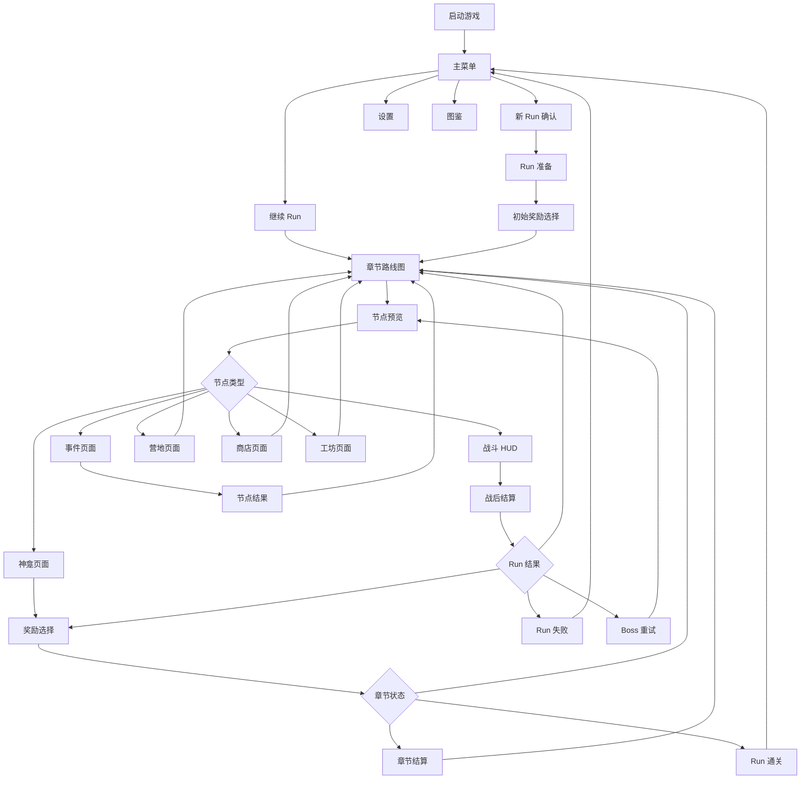

# UI 页面流与信息架构设计

> 日期：2026-06-04  
> 状态：第一版页面级交接规格  
> 依赖：[full_system_design_baseline.md](full_system_design_baseline.md)、[run_structure_design.md](run_structure_design.md)、[battle_objectives_and_rewards.md](battle_objectives_and_rewards.md)、[reward_selection_design.md](reward_selection_design.md)、[../superpowers/specs/2026-06-02-battle-flow-ui-presentation-design.md](../superpowers/specs/2026-06-02-battle-flow-ui-presentation-design.md)

## 1. 目的

本文档是 UI 设计和 UI 实现 agent 的页面级入口，负责把主菜单、Run 准备、路线图、节点预览、战斗 HUD、战后结算、奖励选择、事件、营地、商店、工坊、神龛、失败和通关串成完整流程。

本文档不替代以下细则：

- 战斗内意图、行动顺序栈、预演和动效，以 [2026-06-02-battle-flow-ui-presentation-design.md](../superpowers/specs/2026-06-02-battle-flow-ui-presentation-design.md) 为准。
- 战斗胜负、守护值、奖励任务和 HUD 必显字段，以 [battle_objectives_and_rewards.md](battle_objectives_and_rewards.md) 为准。
- Run 路线、节点预览、存档阶段，以 [run_structure_design.md](run_structure_design.md) 为准。
- 战后结算和奖励选择，以 [reward_selection_design.md](reward_selection_design.md) 为准。

## 2. UI 设计目标

1. 让玩家始终知道当前处于 Run 的哪个阶段。
2. 让玩家能同时读懂 3 条关键线：守护值、守卫者 HP、当前节点风险。
3. 战斗中优先保证棋盘、敌人意图、行动顺序和预演可读。
4. 战斗外优先保证路线选择、资源损耗、奖励收益和下一步风险可读。
5. 所有页面都避免长篇说明，用状态、数值、图标、短标签和详情浮层表达。
6. 所有会改变决策的信息必须在确认前展示。
7. 所有消耗、死亡、腐化和守护值变化必须在确认前后都能追溯。

## 3. 全局页面流



## 4. 全局 UI 框架

### 4.1 常驻资源条

战斗外页面顶部或左上固定显示：

| 信息 | 表达 | 说明 |
|---|---|---|
| 当前章节 | `第 1 章 · 外墙余烬` | 路线和节点预览必显 |
| 守护值 | `10 / 12` | 使用据点 / 防线图标 |
| 余烬 | `23` | 货币图标 |
| 腐化 | `2` | 有阈值时显示进度或警告 |
| 存活守卫者 | 头像 + HP 点 | 死亡头像置灰并标“已死亡” |
| 遗物数量 | 图标 + 数量 | 可点开简表 |

战斗内页面不强制显示完整余烬和遗物清单，但守护值、守卫者 HP、保护目标 HP、回合数和敌人意图必须常驻。

### 4.2 页面导航原则

| 场景 | 规则 |
|---|---|
| 主菜单 | 可进入新 Run、继续 Run、设置、图鉴 |
| Run 内页面 | 允许打开暂停菜单、设置、图鉴；不允许跳过当前节点结果 |
| 奖励选择 | 确认前可返回查看结算摘要；确认后不可撤销 |
| 战斗 HUD | 可暂停，但不能从暂停菜单修改会影响战斗结果的设置 |
| 事件 / 商店 / 工坊 / 营地 | 离开后不能返回本节点继续操作 |

### 4.3 确认与撤销

需要二次确认的操作：

- 覆盖未结束 Run 开始新 Run。
- 选择带腐化、守护值损失或守卫者受伤代价的事件选项。
- 领取不可撤销的遗物、升级、章节奖励。
- 放弃当前 Run。

不需要二次确认的操作：

- 打开节点预览。
- 悬停查看详情。
- 战斗中选择守卫者或预演技能。
- 查看图鉴或设置。

## 5. 视觉与交互基线

### 5.1 风格定位

UI 风格应服务“暗黑小队战术肉鸽”：

- 深色、克制、战术化，不做明亮休闲或二次元卡牌风。
- 信息密度中高，但层级清楚。
- 棋盘和节点风险优先，不让装饰压过关键信息。
- 使用红色表达危险，琥珀 / 金色表达顺序、余烬和可领奖励，灰色表达失效或已完成。
- 避免大面积紫色渐变、科幻全息、过度发光、营销式英雄页。

### 5.2 可读性规则

| 项 | 规则 |
|---|---|
| 正文最小字号 | 移动端不低于 16 px，桌面端不低于 14 px |
| 交互热区 | 触屏最小 44x44 px |
| 对比度 | 普通文本至少 4.5:1 |
| 图标按钮 | 必须有悬停或长按提示 |
| 重要数值 | 不只靠颜色区分，必须有图标或文字 |
| 动效 | 150-300 ms 为主，支持减少动效设置 |

### 5.3 布局规则

- 8x8 战斗棋盘必须稳定尺寸，不因 HUD 文案变化缩放。
- 页面主操作按钮位置在同类页面中保持一致。
- 卡片用于奖励、商品、事件选项、守卫者，不把整页内容塞进大卡片。
- 不在页面区域里再套大卡片形成“卡片套卡片”。
- 长文本进入详情浮层或折叠说明，不撑坏布局。
- 移动端优先纵向：棋盘上方、顺序条中间、技能栏底部。

## 6. 页面清单

| 页面 | Demo | 完整第一版 | 细化文档 |
|---|---|---|---|
| 主菜单 | 必做 | 必做 | 本文档 |
| 新 Run 确认 | 必做 | 必做 | 本文档 |
| Run 准备 | 可简化 | 必做 | 本文档 |
| 初始奖励选择 | 不做 | 必做 | [reward_selection_design.md](reward_selection_design.md) |
| 章节路线图 | 必做 | 必做 | [run_structure_design.md](run_structure_design.md) |
| 节点预览 | 必做 | 必做 | [run_structure_design.md](run_structure_design.md) |
| 战斗 HUD | 必做 | 必做 | 战斗 UI Spec |
| 暂停菜单 | 简化 | 必做 | 本文档 |
| 战后结算 | 必做 | 必做 | [reward_selection_design.md](reward_selection_design.md) |
| 奖励选择 | 必做 | 必做 | [reward_selection_design.md](reward_selection_design.md) |
| 事件 | 必做 | 必做 | 后续 `event_pool_design.md` |
| 营地 | 必做 | 必做 | 后续 `node_screen_design.md` |
| 商店 | 不做 | 必做 | 后续 `node_screen_design.md` |
| 工坊 | 不做 | 必做 | 后续 `node_screen_design.md` |
| 神龛 | 不做 | 可做 | 后续 `node_screen_design.md` |
| 章节结算 | 可简化 | 必做 | 本文档 |
| Run 失败 | 必做 | 必做 | 本文档 |
| Run 通关 | 必做 | 必做 | 本文档 |
| 图鉴 | 占位 | 必做 | 后续图鉴设计 |
| 设置 | 简化 | 必做 | 本文档 |

## 7. 主菜单

### 7.1 目的

主菜单负责进入或管理 Run。第一屏不做复杂教程和长叙事。

### 7.2 必显信息

- 游戏标题。
- 当前版本或 Demo 标识。
- 继续 Run 摘要：章节、节点、守护值、存活守卫者。
- 主操作按钮。

### 7.3 按钮

| 按钮 | 显示条件 | 行为 |
|---|---|---|
| 继续 Run | 有未结束存档 | 进入最近存档阶段 |
| 新 Run | 始终显示 | 有未结束存档时弹覆盖确认 |
| 图鉴 | 始终显示 | 打开已见内容 |
| 设置 | 始终显示 | 打开设置 |
| 退出 | 桌面版显示 | 退出游戏 |

### 7.4 继续 Run 摘要

```text
第 1 章 · 外墙余烬
节点 4 / 6：铁角闸门
守护值 9 / 12
存活守卫者 3 / 3
```

若存档处于奖励页或结算页，显示：

```text
待领取奖励
来源：精英战 · 铁角闸门
```

## 8. 新 Run 与 Run 准备

### 8.1 新 Run 确认

当已有未结束 Run 时弹窗：

| 信息 | 内容 |
|---|---|
| 标题 | 覆盖当前 Run？ |
| 摘要 | 当前章节、守护值、存活守卫者、已获得遗物数量 |
| 主按钮 | 确认新 Run |
| 次按钮 | 返回 |

按钮文案不能模糊，例如不用“确定”，而用“覆盖并开始”。

### 8.2 Run 准备 Demo 版

Demo 可以只显示固定队伍确认页：

- 3 名固定守卫者头像、名称、HP、职责。
- 初始守护值 12 / 12。
- 初始余烬 0。
- 初始腐化 0。
- 无初始遗物。
- 主按钮：出发。

### 8.3 Run 准备完整第一版

完整第一版流程：

```text
难度选择
  -> 守卫者 5 选 3
  -> 初始普通遗物 3 选 1
  -> 出发确认
```

### 8.4 守卫者选择页

必显：

- 守卫者头像 / 棋子预览。
- 名称、初始 HP、职责标签。
- 核心技能简述。
- 已选择数量：`2 / 3`。
- 队伍风险提示，例如缺少防线型角色。

限制：

- 不能选择死亡状态，因为新 Run 中无死亡。
- 不能选择重复守卫者。
- 出发按钮在未满 3 人时禁用。

## 9. 章节路线图

### 9.1 目的

路线图负责让玩家做风险与收益选择。

### 9.2 布局

推荐结构：

- 顶部：章节名、节点进度、常驻资源条。
- 中部：分层路线图。
- 右侧或底部：当前选中节点预览摘要。
- 底部：确认前往按钮。

### 9.3 节点视觉语言

| 节点 | 图标 / 形状建议 | 颜色倾向 |
|---|---|---|
| 普通战 | 剑 / 盾 | 中性灰 + 红色风险角标 |
| 精英战 | 双剑 / 角 | 深红 |
| 事件 | 卷轴 / 问号 | 琥珀 |
| 营地 | 篝火 | 暖金 |
| 商店 | 钱袋 | 金色 |
| 工坊 | 铁砧 | 钢灰 |
| 神龛 | 裂纹碑 | 紫黑或腐化绿，需克制使用 |
| Boss | 钟 / 王冠 / 巨门 | 深红 + 金边 |

风险等级用 1-5 个短刻度或角标表达，不只靠颜色。

### 9.4 必显状态

- 当前节点。
- 可达节点。
- 已完成节点。
- 不可达节点。
- 高风险路线。
- 高腐化路线。
- Boss 节点。

### 9.5 交互

| 操作 | 行为 |
|---|---|
| 悬停 / 选中节点 | 打开节点预览 |
| 点击可达节点 | 选中，不立即进入 |
| 点击确认 | 进入节点预览确认态或直接进入节点 |
| 点击不可达节点 | 显示不可达原因 |

## 10. 节点预览

### 10.1 目的

节点预览是玩家确认风险前的最后信息页。会影响决策的内容必须公开。

### 10.2 战斗节点预览

必须显示：

| 信息 | 示例 |
|---|---|
| 节点类型 | 普通战、精英战、Boss |
| 压力标签 | 裂隙压力、远程线压 |
| 风险等级 | 3 / 5 |
| 裂隙强度 | 1 |
| 敌人提示 | 腐食兽、瘟疫弓手，可能出现铁角兽 |
| 硬威胁上限 | 本场每回合最多 2 |
| 地图提示 | 石柱、深渊边缘、关键建筑 |
| 回合数 | 5 |
| 保护目标 | 普通建筑 4 |
| 基础奖励 | 7 余烬 |
| 额外奖励 | 奖励任务、遗物、章节奖励 |
| 队伍状态 | 守卫者 HP、死亡状态 |

### 10.3 非战斗节点预览

| 节点 | 必显 |
|---|---|
| 事件 | 事件主题、影响资源类型、风险等级 |
| 营地 | 可治疗小队或修复防线 |
| 商店 | 商品类别、是否包含治疗和修复 |
| 工坊 | 可购买升级类别、价格范围 |
| 神龛 | 高腐化警告、可能收益、可能代价 |

### 10.4 确认按钮

按钮文案要匹配节点：

- 进入战斗。
- 处理事件。
- 进入营地。
- 打开商店。
- 前往工坊。
- 触碰神龛。

高风险节点确认按钮上方显示简短警告，例如：

```text
当前仅剩 2 名守卫者，进入精英战风险较高。
```

## 11. 战斗 HUD

战斗 HUD 的细节以战斗 UI Spec 为准。本文档只定义页面级信息层级。

### 11.1 桌面版推荐布局

- 左侧或中部：8x8 棋盘，占最大面积。
- 顶部：回合、阶段、守护值、本场主目标。
- 右侧：敌方行动顺序栈。
- 底部：守卫者头像、技能按钮、结束回合。
- 左下或右下：奖励任务进度。

### 11.2 移动端 / 窄屏推荐布局

- 上方：回合、阶段、守护值。
- 中上：8x8 棋盘。
- 棋盘下方：敌方行动顺序横条。
- 底部：守卫者和技能栏。
- 奖励任务折叠为可展开抽屉。

### 11.3 HUD 必显信息

| 优先级 | 信息 |
|---|---|
| 最高 | 棋盘、敌人意图、攻击顺序、行动预演 |
| 最高 | 守护值、当前回合、主目标 |
| 最高 | 守卫者 HP、保护目标 HP |
| 高 | 奖励任务进度 |
| 中 | 当前余烬、遗物触发 |
| 低 | 调试信息 |

### 11.4 战斗内暂停菜单

可操作：

- 继续战斗。
- 设置。
- 放弃 Run。
- 返回主菜单。

不可操作：

- 修改会影响战斗结果的难度。
- 重置当前回合。
- 回滚行动，除非未来单独设计撤销系统。

## 12. 战后结算

战后结算页以 [reward_selection_design.md](reward_selection_design.md) 为准。

### 12.1 页面目标

解释刚才发生了什么，并明确下一步。

### 12.2 必显模块

- 战斗结果。
- 主目标达成状态。
- 守护值变化。
- 建筑受损 / 被毁。
- 守卫者 HP、濒死、死亡。
- 奖励任务完成和失败原因。
- 固定奖励摘要。
- 下一步按钮。

### 12.3 文案规则

死亡守卫者统一写：

```text
已死亡 / 本 Run 离队
```

不使用“撤离”“倒地”“归队”等容易误解的词。

## 13. 奖励选择

奖励选择页以 [reward_selection_design.md](reward_selection_design.md) 为准。

### 13.1 页面目标

让玩家在少量高价值选项中做构筑选择。

### 13.2 推荐布局

- 顶部：奖励来源和固定奖励。
- 左侧：当前资源和队伍状态。
- 中部：奖励卡。
- 右侧：选中预览、协同、限制原因。
- 底部：重抽、跳过、确认。

### 13.3 卡片类型

| 卡片 | 必显 |
|---|---|
| 遗物 | 稀有度、类型标签、触发时机、规则效果 |
| 升级 | 守卫者、升级类别、技能变化、限制 |
| 恢复 | 守护值或 HP 变化、是否受上限影响 |
| 章节奖励 | 对下一章的影响 |
| 风险奖励 | 腐化、HP 或守护值代价 |

## 14. 事件页面

### 14.1 页面目标

用 2-3 个明确选项制造资源取舍。

### 14.2 布局

- 顶部：事件标题和短描述。
- 中部：2 个主选项，最多 1 个跳过选项。
- 侧边：当前资源和队伍状态。
- 底部：返回路线或确认按钮。

### 14.3 选项卡必显

| 信息 | 说明 |
|---|---|
| 收益 | 余烬、遗物、升级、治疗等 |
| 代价 | 腐化、守护值、HP、下一战风险 |
| 目标 | 哪名守卫者、当前防线或下一战 |
| 变化预览 | 例如腐化 2 -> 4 |

事件不能隐藏代价。若选项有随机目标，必须写清候选范围，例如“随机 1 名存活守卫者受 1 伤”。

## 15. 营地页面

### 15.1 页面目标

让玩家在人员线和防线线之间取舍。

### 15.2 Demo 选项

| 选项 | 效果 |
|---|---|
| 治疗小队 | 所有存活守卫者 +1 HP，不超过上限 |
| 修复防线 | 守护值 +2，不超过上限 |

### 15.3 完整第一版扩展

| 选项 | 效果 |
|---|---|
| 整备装备 | 获得 1 个普通升级选项，第 2 章后出现 |

### 15.4 UI 要求

- 进入营地时显示守护值和每名守卫者 HP。
- 选项卡显示选择后的数值变化。
- 死亡守卫者头像置灰，不参与治疗。
- 每次营地只能选 1 项。

## 16. 商店页面

### 16.1 页面目标

出售遗物、小额治疗、小额守护值修复。

### 16.2 布局

- 顶部：商店标题和当前余烬。
- 中部：商品列表。
- 侧边：队伍状态、守护值、已有遗物。
- 底部：离开商店。

### 16.3 商品卡必显

- 名称。
- 类型。
- 价格。
- 规则效果。
- 当前是否可购买。
- 购买后余烬。
- 对象选择，如果是治疗。

离开商店后不能返回本节点继续购买。

## 17. 工坊页面

### 17.1 页面目标

定向购买守卫者升级。

### 17.2 布局

- 左侧：守卫者列表。
- 中部：可购买升级。
- 右侧：当前技能、已有升级、购买后变化。
- 底部：刷新、购买、离开。

### 17.3 必显限制

- 每名守卫者每章最多 1 次升级。
- 死亡守卫者不可升级。
- 已拥有升级不重复出现。
- 余烬不足时按钮禁用。

## 18. 神龛页面

### 18.1 页面目标

提供高收益高腐化选择。

### 18.2 必显

- 高风险标记。
- 腐化变化和阈值效果。
- 可能收益。
- 守护值、HP 或腐化代价。
- 二次确认。

神龛不能用模糊文案包装代价。腐化跨阈值时必须显示后续影响。

## 19. 章节结算

### 19.1 触发

第 1 章和第 2 章 Boss 胜利并领取章节奖励后进入。

### 19.2 必显

- 章节名称。
- 本章完成节点数量。
- 本章守护值变化。
- 守卫者死亡和濒死情况。
- 获得遗物和升级。
- 完成奖励任务数量。
- 下一章预告：主题、主要压力标签、可能敌人。

### 19.3 操作

- 进入下一章。
- 查看本章摘要。
- 打开图鉴或设置。

第 3 章 Boss 胜利后不进入章节结算，而进入 Run 通关。

## 20. Run 失败

### 20.1 必显

- 失败原因。
- 到达章节和节点。
- 守护值最终值。
- 守卫者死亡列表。
- 已获得遗物和升级。
- 完成奖励任务数量。
- 返回主菜单按钮。

### 20.2 失败原因文案

| 失败 | 文案 |
|---|---|
| 守护值耗尽 | 防线彻底崩溃 |
| 队伍覆灭 | 守卫者全员死亡 |
| Boss 反复溃败 | Boss 压力耗尽守护值 |

不要把“保护目标全毁”直接写成 Run 失败原因。保护目标全毁是防线溃败，只有守护值归 0 才是 Run 失败。

## 21. Run 通关

### 21.1 必显

- 通关标题。
- 最终守护值。
- 存活守卫者。
- 死亡守卫者。
- 最终遗物和升级。
- 完成节点数量。
- 完成奖励任务数量。
- 返回主菜单。

### 21.2 后续扩展

后续可加入评分、解锁、统计图，但第一版不把这些作为通关必要信息。

## 22. 图鉴和设置

### 22.1 图鉴

Demo 可以占位。完整第一版图鉴至少包含：

- 已见守卫者。
- 已见敌人。
- 已见遗物。
- 已见地形。
- 奖励任务说明。

图鉴不影响 Run 内战斗结果，只作为信息回看。

### 22.2 设置

第一版必须包含：

- 音量。
- 全屏 / 窗口。
- 文本速度或动画速度。
- 减少动效。
- 语言。

战斗中修改“减少动效”应即时生效，但不能改变规则和结果。

## 23. 数据需求

### 23.1 全局页面状态

| 数据 | 用途 |
|---|---|
| `phase` | 恢复页面和决定可操作入口 |
| `run_id` | 当前存档 |
| `chapter_index` | 章节展示 |
| `current_node_id` | 路线图和继续 Run 摘要 |
| `sanctuary_integrity` | 守护值显示 |
| `embers` | 货币显示和购买 |
| `corruption` | 腐化显示和阈值提示 |
| `wardens` | 队伍状态 |
| `relics` | 构筑显示 |
| `pending_reward` | 奖励页恢复 |

### 23.2 节点预览数据

| 数据 | 用途 |
|---|---|
| `node_type` | 图标和确认按钮 |
| `risk_level` | 风险角标 |
| `pressure_tags` | 压力说明 |
| `rift_strength` | 裂隙强度 |
| `enemy_pool_hint` | 敌人提示 |
| `map_tags` | 地形提示 |
| `base_reward` | 奖励预览 |
| `preview_warnings` | 残编、高腐化、Boss 警告 |

### 23.3 战斗 HUD 数据

以战斗 UI Spec 为准，至少包括：

- 敌方执行顺序。
- 敌人当前格。
- 锁定攻击方向。
- 当前实际攻击格。
- 当前实际伤害。
- 玩家行动预演结果。
- 守护值。
- 保护目标 HP。
- 守卫者 HP。
- 奖励任务进度。

## 24. Demo UI 范围

第一轮 Demo 必做：

1. 主菜单。
2. 新 Run 固定队伍确认。
3. 章节路线图。
4. 节点预览。
5. 战斗 HUD：棋盘、守护值、回合、敌方顺序栈、守卫者 HP、奖励任务。
6. 战后结算。
7. 精英战遗物奖励选择。
8. 事件 2 选 1。
9. 营地治疗 / 修复 2 选 1。
10. Boss 重试或 Run 失败页面。
11. Run 通关页面。
12. 简化设置。

Demo 可以占位：

- 图鉴。
- 商店。
- 工坊。
- 神龛。
- 初始遗物选择。
- 章节结算复杂统计。

## 25. 验收标准

| 场景 | 标准 |
|---|---|
| 新玩家进入战斗 | 能看懂主目标是撑到最大回合，而不是清怪 |
| 建筑受伤 | 战斗内预演和结算都明确显示扣了多少守护值 |
| 守卫者死亡 | 棋盘移除，结算写明本 Run 离队 |
| 奖励任务完成 | HUD 有进度，结算有奖励明细 |
| 精英战胜利 | 能看到固定余烬和遗物选择 |
| 残编进入节点 | 节点预览显示高风险提示 |
| 腐化跨阈值 | 选择前显示后续影响 |
| 继续 Run | 回到正确阶段，不重复领奖 |
| Boss 溃败未失败 | 不发奖励，回到同一 Boss 节点预览 |
| 移动端窄屏 | 棋盘、顺序条和技能栏不重叠 |

## 26. 参考图

当前已有 UI 参考图：

- [defense_hud_reference_gpt-image-2.png](ui_reference/defense_hud_reference_gpt-image-2.png)
- [final_battle_ui_gpt-image-2_v1.png](ui_reference/final_battle_ui_gpt-image-2_v1.png)

这些图用于方向参考，不是最终 UI 贴图。实际 UI 仍需按本文档和战斗 UI Spec 校正信息层级。
