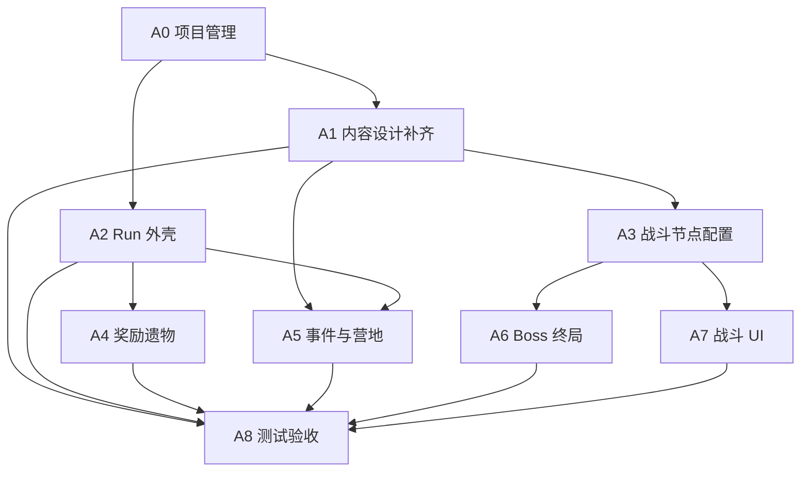

# Demo Run 项目管理与并行任务拆分

> 日期：2026-06-04  
> 状态：项目管理基线  
> 范围：1 章 6 节点 Demo Run，从主菜单进入新 Run 到 Boss 通关或 Run 失败  
> 必读入口：[../AI_README.md](../AI_README.md)

## 1. 管理目标

本文档把当前设计文档转成可由多个 agent 并行推进的开发计划，并建立“文档状态、设计状态、开发状态、测试状态”之间的同步规则。

近期目标不是做完整 3 章肉鸽，而是跑通第一轮 Demo：

```text
主菜单
  -> 新 Run
  -> 固定 3 名守卫者
  -> 章节路线图
  -> 普通战
  -> 事件
  -> 普通战
  -> 精英战
  -> 营地
  -> Boss
  -> Run 结算
```

当前实现已有成熟战斗垂直切片，包括 8x8 棋盘、3 名守卫者、2 类敌人、地裂、公开意图、预演、保护目标、奖励任务和测试。Demo Run 的主要缺口在战斗外壳、内容配置、奖励/遗物落地、事件/营地节点、Boss 脚本和最小存档。

## 2. 当前状态判定

| 模块 | 当前状态 | 管理判断 | 依据 |
|---|---|---|---|
| 核心玩法方向 | 已定稿 | 可作为所有任务最高裁定 | [../design/defense_roguelite_core_design.md](../design/defense_roguelite_core_design.md) |
| 战斗切片 | 已有基础实现 | 可继续扩展，不需要重写 | [../demo_features.md](../demo_features.md)、[../architecture/framework_design.md](../architecture/framework_design.md) |
| 战斗胜负与保护目标 | 已实现第一版 | 需要对齐“防线溃败扣守护值后 Run 继续”的 Run 层语义 | [../design/battle_objectives_and_rewards.md](../design/battle_objectives_and_rewards.md) |
| Run 状态 | 已有 `RunState` 雏形 | 可作为 Demo 外壳基础，但还缺存档文件和页面接线 | [../../scripts/run/run_state.gd](../../scripts/run/run_state.gd) |
| Demo 路线 | 文档定稿，代码雏形存在 | 需要调整为“普通战、事件、普通战、精英战、营地、Boss” | [../design/run_structure_design.md](../design/run_structure_design.md) |
| 奖励选择 | 文档定稿，代码占位 | 需要接入 12 个 Demo 遗物和奖励页 UI | [../design/reward_selection_design.md](../design/reward_selection_design.md)、[../design/relic_pool_design.md](../design/relic_pool_design.md) |
| 事件池 | 已补齐 | Demo 6 个事件、选项、收益代价、`pending_reward` 和 UI 必显信息已可交接 | [../design/event_pool_design.md](../design/event_pool_design.md) |
| 地图池 | 已补齐 | Demo 4 张固定路线地图 + 2 张候补地图，含 8x8 坐标、敌群和裂隙表 | [../design/map_pool_design.md](../design/map_pool_design.md) |
| 最小存档 | 已补齐 | 最小字段、版本、`pending_reward` 防重复领取、入口快照和崩溃恢复已可交接 | [../design/save_run_design.md](../design/save_run_design.md) |

## 3. 里程碑

| 里程碑 | 目标 | 完成标准 |
|---|---|---|
| M0：管理基线 | 任务拆分、文档状态和 agent 边界明确 | 本文档落地，后续 agent 能按工作包开工 |
| M1：设计解除阻塞 | 补齐 `event_pool_design.md`、`map_pool_design.md`、`save_run_design.md` 的 Demo 范围 | `doc_status_inventory.md` 和 `AI_README.md` 同步更新 |
| M2：Run 外壳可走通 | 主菜单、新 Run、路线图、节点预览、战后结算、奖励选择和 Run 结果形成闭环 | 不要求所有内容丰富，但可以从入口跑到结局 |
| M3：战斗内容接入 | 4 个战斗节点使用不同地图、敌群、奖励任务和 Run 状态输入 | 节点预览与实际战斗配置一致 |
| M4：奖励与遗物可用 | 精英战、Boss 和高完成奖励能生成并领取遗物 / 升级 / 守护值恢复，Boss 心脏钟命中收益可见且可领取 | `pending_reward` 防重复领取有效 |
| M5：事件与营地可用 | 事件节点和营地节点改变 Run 状态，并回到路线图 | 选择前展示收益代价，选择后不可重复进入 |
| M6：Boss 终局 | Demo Boss 6 回合脚本、毁灭计数、锚石、心脏钟命中奖励、奖励任务和重试语义可用 | 不以击杀 Boss 或清怪提前胜利 |
| M7：验收与文档收口 | Demo Run 测试、文档状态和功能清单同步 | 测试通过，功能清单反映真实状态 |

## 4. 并行工作包

### A0：项目管理与文档状态

| 项 | 内容 |
|---|---|
| 适合 agent | PM / Tech Lead agent |
| 当前优先级 | P0 |
| 可并行性 | 可与所有实现 agent 并行，但需要审查合并顺序 |
| 必读文档 | [../AI_README.md](../AI_README.md)、[../design/doc_status_inventory.md](../design/doc_status_inventory.md)、本文档 |
| 主要文件 | `docs/management/`、[../design/doc_status_inventory.md](../design/doc_status_inventory.md)、[../AI_README.md](../AI_README.md)、[../demo_features.md](../demo_features.md) |
| 交付物 | 维护任务看板、更新文档状态、记录已完成和阻塞项 |
| 验收 | 任一 agent 完成工作后，文档能准确反映当前状态和下一步 |

A0 不直接改玩法规则。发现设计冲突时，新开或更新对应设计文档，再同步状态清单。

### A1：P0 内容设计补齐

| 项 | 内容 |
|---|---|
| 适合 agent | Content Design agent |
| 当前优先级 | P0 |
| 可并行性 | 可先于或并行于 Run 外壳；实现 agent 使用临时配置时必须标注 |
| 必读文档 | [../design/run_design_gap_checklist.md](../design/run_design_gap_checklist.md)、[../design/enemy_map_encounter_design.md](../design/enemy_map_encounter_design.md)、[../design/relic_pool_design.md](../design/relic_pool_design.md)、[../design/run_structure_design.md](../design/run_structure_design.md) |
| 主要文件 | `docs/design/event_pool_design.md`、`docs/design/map_pool_design.md`、`docs/design/save_run_design.md` |
| 交付物 | Demo 事件 4-6 个、Demo 地图 4-6 张、最小存档字段 |
| 验收 | 每个事件、地图、存档字段都能被实现 agent 直接转成配置或代码 |

建议拆成 3 个子任务：

| 子任务 | 输出 | 依赖 |
|---|---|---|
| A1.1 事件池 | `event_pool_design.md`：事件 ID、标题、选项、收益、代价、权重、Demo 使用列表 | Run 经济、奖励选择 |
| A1.2 地图池 | `map_pool_design.md`：地图 ID、建筑、石柱、地裂、深渊边缘、敌群预算、适用节点 | 敌人地图文档 |
| A1.3 最小存档 | `save_run_design.md`：保存时机、字段、版本、防重复领奖、恢复策略 | Run 结构、奖励选择 |

### A2：Run 外壳与页面流

| 项 | 内容 |
|---|---|
| 适合 agent | Gameplay Shell / UI Flow agent |
| 当前优先级 | P0 |
| 可并行性 | 可与 A3、A4、A5 并行；需要稳定 `RunState` 接口 |
| 必读文档 | [../design/full_system_design_baseline.md](../design/full_system_design_baseline.md)、[../design/run_structure_design.md](../design/run_structure_design.md)、[../design/ui_screen_flow_design.md](../design/ui_screen_flow_design.md) |
| 主要文件 | [../../scripts/run/run_state.gd](../../scripts/run/run_state.gd)、`scripts/core/`、`Scenes/`、`scripts/view/` |
| 交付物 | 主菜单、新 Run、固定队伍确认、路线图、节点预览、Run 失败、Run 通关 |
| 验收 | 从 Godot 入口可以进入 Demo Run，并按节点顺序推进到结局 |

接口边界：

- A2 负责页面跳转和 Run phase，不负责实现遗物效果、Boss 内部脚本或事件内容细则。
- A2 需要给 A3 提供进入战斗的 `node.battle` 配置。
- A2 需要给 A4 提供 `pending_reward` 的展示和确认入口。

### A3：战斗节点配置与地图接入

| 项 | 内容 |
|---|---|
| 适合 agent | Combat Config agent |
| 当前优先级 | P0 |
| 可并行性 | 可与 A2 并行；依赖 A1.2 的最终地图池，短期可用临时配置 |
| 必读文档 | [../design/battle_objectives_and_rewards.md](../design/battle_objectives_and_rewards.md)、[../design/enemy_map_encounter_design.md](../design/enemy_map_encounter_design.md)、[../design/round_flow_and_intent.md](../design/round_flow_and_intent.md)、[../design/combat_resolution_truth_table.md](../design/combat_resolution_truth_table.md) |
| 主要文件 | `scripts/battle/`、`scripts/data/`、`scripts/tests/`、[../../scripts/run/run_state.gd](../../scripts/run/run_state.gd) |
| 交付物 | 普通战、精英战、Boss 前普通战的地图/敌群/地裂/奖励任务配置 |
| 验收 | 每个战斗节点的节点预览、实际战斗、结算字段一致 |

重点风险：

- 当前战斗层把所有保护目标全毁直接标记战斗失败；Run 设计要求“防线溃败，只按本场保护目标累计受伤扣守护值，若守护值仍大于 0 则 Run 继续”。实现时需要在 Run 层把 `line_breached` 与 `outcome` 区分清楚，避免把可继续的溃败误判为 Run 失败。
- 不允许恢复旧逻辑“敌人全灭即胜利”。

### A4：奖励、遗物与升级

| 项 | 内容 |
|---|---|
| 适合 agent | Reward / Economy agent |
| 当前优先级 | P0 |
| 可并行性 | 可与 A2、A3 并行；需要与 A2 对齐奖励页入口 |
| 必读文档 | [../design/reward_selection_design.md](../design/reward_selection_design.md)、[../design/relic_pool_design.md](../design/relic_pool_design.md)、[../design/run_relic_economy_design.md](../design/run_relic_economy_design.md)、[../design/warden_roster_and_upgrades.md](../design/warden_roster_and_upgrades.md) |
| 主要文件 | [../../scripts/run/run_state.gd](../../scripts/run/run_state.gd)、`scripts/data/`、`scripts/tests/`、奖励 UI 文件 |
| 交付物 | Demo 12 遗物数据、奖励选项生成、领取写回、防重复领奖、基础升级 |
| 验收 | 精英战和奖励任务完成数能稳定影响奖励；领取后 `pending_reward` 清空且不可重复领取 |

第一版实现建议：

| 范围 | Demo 要求 |
|---|---|
| 遗物数据 | 先全部数据化展示，效果可分批实装 |
| 立即实装效果 | 守护值恢复、奖励选项 +1、角色 HP 升级、少量位移 / 防守遗物 |
| 可延后效果 | 复杂战斗中触发的碎裂、临时路障、废墟邻接减速 |

### A5：事件与营地节点

| 项 | 内容 |
|---|---|
| 适合 agent | Node Content agent |
| 当前优先级 | P1，事件节点对 Demo 路线是 P0 |
| 可并行性 | 事件依赖 A1.1；营地可按现有规则先做最小版 |
| 必读文档 | [../design/full_system_design_baseline.md](../design/full_system_design_baseline.md)、[../design/run_structure_design.md](../design/run_structure_design.md)、[../design/run_relic_economy_design.md](../design/run_relic_economy_design.md)、后续 `event_pool_design.md` |
| 主要文件 | `scripts/run/`、`Scenes/`、`scripts/view/` |
| 交付物 | 事件页、营地页、状态写回、节点完成后回路线图 |
| 验收 | 事件和营地不会进入战斗；选择收益代价可预览，确认后不可重复操作 |

Demo 营地最小规则：

| 选项 | 效果 |
|---|---|
| 治疗小队 | 所有存活守卫者 +1 HP，不超过上限 |
| 修复防线 | 守护值 +2，不超过上限 |

### A6：Boss 终局脚本

| 项 | 内容 |
|---|---|
| 适合 agent | Boss / Combat Systems agent |
| 当前优先级 | P1，M6 前必须完成 |
| 可并行性 | 可在 A3 地图接入后独立推进 |
| 必读文档 | [../design/boss_node_design.md](../design/boss_node_design.md)、[../design/battle_objectives_and_rewards.md](../design/battle_objectives_and_rewards.md)、[../design/enemy_map_encounter_design.md](../design/enemy_map_encounter_design.md) |
| 主要文件 | `scripts/battle/`、`scripts/data/`、`scripts/view/hud.gd`、`scripts/tests/` |
| 交付物 | 毁灭计数、2 个锚石、心脏钟暴露窗口、6 回合 Boss 脚本、Boss 奖励任务 |
| 验收 | Boss 胜利仍看最大回合防守，锚石和心脏钟只降低压力或完成奖励任务 |

### A7：战斗 UI 完成度

| 项 | 内容 |
|---|---|
| 适合 agent | Battle UI agent |
| 当前优先级 | P1 |
| 可并行性 | 可与战斗逻辑并行，但必须使用逻辑层真实预演结果 |
| 必读文档 | [../superpowers/specs/2026-06-02-battle-flow-ui-presentation-design.md](../superpowers/specs/2026-06-02-battle-flow-ui-presentation-design.md)、[../design/ui_screen_flow_design.md](../design/ui_screen_flow_design.md)、[../design/battle_objectives_and_rewards.md](../design/battle_objectives_and_rewards.md) |
| 主要文件 | `scripts/view/`、`Scenes/battle/`、`art/ui/` |
| 交付物 | 守护值、保护目标 HP、奖励任务、敌方行动顺序栈、预演状态和结算反馈 |
| 验收 | 玩家不读规则说明也能判断主目标、当前威胁、奖励任务和损失原因 |

### A8：测试、验收与回归

| 项 | 内容 |
|---|---|
| 适合 agent | QA / Test agent |
| 当前优先级 | P0，贯穿所有里程碑 |
| 可并行性 | 可与所有实现包并行 |
| 必读文档 | [../demo_features.md](../demo_features.md)、[../architecture/framework_design.md](../architecture/framework_design.md)、所有被测功能对应设计文档 |
| 主要文件 | `scripts/tests/`、`docs/demo_features.md` |
| 交付物 | Run 状态测试、奖励领取测试、节点推进测试、战斗目标回归、Boss 回归 |
| 验收 | `godot --headless --path . -s scripts/tests/test_runner.gd` 通过；新增功能至少有关键逻辑测试 |

## 5. 依赖关系



并行建议：

| 批次 | 可同时开的 agent | 原因 |
|---|---|---|
| 第 1 批 | A1、A2、A4、A8 | A1 补设计，A2 搭壳，A4 数据化奖励，A8 建测试骨架，冲突文件较少 |
| 第 2 批 | A3、A6 | A3 接地图战斗，A6 做 Boss 终局骨架；两者共享少量 battle scene 接口，需要主线程审查 |
| 第 3 批 | A7、A8 | A7 在 Boss 与地图接口稳定后补 UI，A8 做最终验收 |

## 6. 文档与开发进度挂钩规则

每个任务必须同时维护 4 类状态：

| 状态 | 维护位置 | 更新时机 |
|---|---|---|
| 设计状态 | [../design/doc_status_inventory.md](../design/doc_status_inventory.md) | 新增、废弃、替换或定稿设计文档时 |
| 开发状态 | 本文档“任务状态表” | 任务开始、阻塞、完成、范围变更时 |
| 实现状态 | [../demo_features.md](../demo_features.md) | 功能真实跑通或行为发生变化时 |
| Agent 入口 | [../AI_README.md](../AI_README.md) | 新文档成为后续 agent 必读路径时 |

完成一个工作包的最低文档要求：

1. 若新增设计文档，必须把它加入 [../design/doc_status_inventory.md](../design/doc_status_inventory.md)。
2. 若改变 agent 读取路径，必须更新 [../AI_README.md](../AI_README.md)。
3. 若改变真实功能，必须更新 [../demo_features.md](../demo_features.md)。
4. 若任务完成或拆分变化，必须更新本文档的任务状态表。

## 7. 任务状态表

| ID | 工作包 | 状态 | 负责人 | 依赖 | 下一步 |
|---|---|---|---|---|---|
| A0 | 项目管理与文档状态 | 进行中 | PM agent | 无 | 建立本文档，后续维护 |
| A1.1 | Demo 事件池设计 | 已完成 | Content agent | 无 | 已交付 `event_pool_design.md`：6 个事件、选项收益代价、UI 必显信息和配置字段 |
| A1.2 | Demo 地图池设计 | 已完成 | Content agent | 无 | 已交付 `map_pool_design.md`：4 张固定路线地图 + 2 张候补地图、8x8 坐标、敌群和 `rift_schedule` |
| A1.3 | 最小存档设计 | 已完成 | System design agent | 无 | 已交付 `save_run_design.md`：保存时机、字段、版本、`pending_reward` 防重复领取和崩溃恢复 |
| A2 | Run 外壳与页面流 | 已完成 | UI Flow agent | A0 | 已接入主菜单、新 Run、固定路线、节点预览、事件、营地、战斗结算、奖励和 Run 结果闭环 |
| A3 | 战斗节点配置与地图接入 | 已完成 | Combat Config agent | A1.2 | 4 个固定路线战斗节点已接入 `BattleConfigCatalog`、`RunState.battle.config_id/map_id` 和 BattleScene 优先读取；`scripted_spawns`、专属敌人 UnitDef / 规则、地图专属奖励任务已接入；剩余为表现增强 |
| A4 | 奖励、遗物与升级 | 已完成 | Reward agent | A2 接口 | Demo 12 遗物已数据化；`pending_reward`、领取写回、防重复领奖和基础升级测试已通过 |
| A4.1 | Boss 心脏钟收益链 | 已完成 | Lead + Explorer agent | A4、A6 | `boss_heart_hits` 已进入 Boss 章节 `pending_reward`，按命中次数追加固定余烬和可见 modifier；奖励页展示修正来源，防重复领取测试已通过 |
| A5 | 事件与营地节点 | 已完成 | Node Content agent | A1.1、A2 | Demo 最小事件页和营地页已接入；完整事件池配置替换留给后续配置接入 |
| A6 | Boss 终局脚本 | 已完成 | Boss agent | A3 | 已接入 Demo Boss 逻辑：毁灭计数、2 个锚石、心脏钟暴露窗口、直接攻击 / 推撞命中、第 1 次压制第 6 回合 Doom、第 2 次终局 Doom -1、第 3 次完成 `heart_window` 奖励任务、Boss 溃败 summary 字段和回归测试 |
| A7 | 战斗 UI 完成度 | 已完成 | Battle UI agent | A3、A6 | 已补齐 HUD 目标摘要、保护目标 HP、奖励任务、敌方行动顺序栈、独立 Boss 状态区、Boss Doom / 锚石 / 心脏钟事件反馈和战斗结束原因；复杂动效留给后续 |
| A8 | 测试、验收与回归 | 已完成 | QA agent | 所有实现包 | 已接入 Run 回归测试、Boss 回归测试、战斗 UI 回归测试和 Demo Run 验收清单；当前 Godot 643 断言通过 |
| A9 | 守卫者 3 技能系统 | 待开始 | Combat Ability agent | A7、A8 | 目标设计已定：每名守卫者 3 个主动技能；下一步接入 `AbilityDef`、`BattleAction.USE_ABILITY`、技能目标 / 预演 / 结算、数据驱动技能栏，并把移动改为棋盘直接操作、遗物强化并入技能描述 |

状态枚举：

| 状态 | 含义 |
|---|---|
| 未开始 | 尚未分配或尚未改动 |
| 进行中 | 已开始，有本地改动或文档草案 |
| 阻塞 | 缺设计裁定、接口或上游交付 |
| 待验收 | 代码 / 文档已完成，等待测试和 review |
| 已完成 | 测试通过，文档同步完成 |

## 8. Agent 开工模板

后续分配任务时，建议直接复制以下模板：

```text
任务 ID：
目标：
必须先读：
允许修改：
禁止修改：
交付物：
验收命令：
完成后必须同步的文档：
```

示例：

```text
任务 ID：A4
目标：实现 Demo 奖励、遗物和升级选择。
必须先读：docs/AI_README.md、docs/design/reward_selection_design.md、docs/design/relic_pool_design.md。
允许修改：scripts/run/、scripts/data/、奖励相关 UI、scripts/tests/。
禁止修改：战斗胜利条件、archive 文档。
交付物：Demo 12 遗物数据、pending_reward 领取写回、奖励领取测试。
验收命令：godot --headless --path . -s scripts/tests/test_runner.gd。
完成后必须同步的文档：docs/demo_features.md、docs/management/demo_run_project_plan.md。
```

## 9. 集成与审查规则

主线程负责所有工作包的最终审查和合并判断。第一批 agent 的推荐集成顺序：

1. A1 文档补齐：先合设计文档，解除 A3 / A5 的内容阻塞。
2. A8 测试骨架：再合不改变运行时行为的测试和验收清单。
3. A4 奖励与遗物：合并 `pending_reward` 和数据化奖励逻辑。
4. A2 Run 外壳：最后合入口、页面流和节点推进，避免 UI 壳依赖未稳定的数据接口。

每个工作包审查时至少检查：

| 检查项 | 通过标准 |
|---|---|
| 文件边界 | 没有越权修改其他 agent 的主要负责范围 |
| 设计一致性 | 不违反 [../AI_README.md](../AI_README.md) 中的不可违反设计 |
| 状态同步 | 相关文档状态、实现状态和任务状态已更新 |
| 测试 | 新增或受影响逻辑有测试，或明确说明无法自动测的原因 |
| 回归 | Godot 测试和 Markdown 校验按改动类型执行 |

以下改动必须由主线程复核后才能继续下游实现：

- 改变战斗胜负、最大回合胜利、防线溃败或 Run 失败语义。
- 改变 `pending_reward` 数据结构或领取时机。
- 改变 `RunState` 的公开字段、phase 或节点推进方法。
- 新增会影响战斗预演一致性的 UI 逻辑。
- 新增或废弃任何权威设计文档。

## 10. 风险清单

| 风险 | 影响 | 缓解 |
|---|---|---|
| 多 agent 同时改 `RunState` | 合并冲突和状态语义漂移 | A2 先稳定接口，其他 agent 只通过公开方法写回 |
| 文档已定但代码使用临时占位 | 后续 agent 误以为占位是最终规则 | 所有占位必须写入任务状态表和代码注释 |
| 防线溃败被误当成 Run 失败 | 与当前核心设计冲突 | 区分战斗结果、节点结果和 Run 结果 |
| 奖励直接写回，绕过 `pending_reward` | 重复领奖和继续 Run 难处理 | A4 必须统一奖励入口 |
| Boss 被实现成击杀胜利 | 破坏核心玩法方向 | A6 必须以最大回合防守和毁灭计数为准 |
| UI 展示与真实预演不一致 | 完美信息承诺失效 | A7 只能读取逻辑层预演结果 |

## 11. 验收口径

Demo Run 完成不是“所有第一版系统都完整”，而是满足以下闭环：

1. 可以从主菜单开始新 Run。
2. 固定 3 名守卫者和守护值进入路线。
3. 路线中包含普通战、事件、普通战、精英战、营地、Boss。
4. 战斗节点读取 Run 状态，结算后写回守护值、守卫者 HP、奖励任务和奖励。
5. 事件和营地节点改变 Run 状态，并标记节点完成。
6. 精英战和 Boss 能发放可选奖励。
7. 守护值归 0 或全队死亡进入 Run 失败。
8. Boss 胜利进入 Demo 通关结算。
9. 关键逻辑测试通过。
10. [../demo_features.md](../demo_features.md) 和 [../design/doc_status_inventory.md](../design/doc_status_inventory.md) 与真实状态一致。
