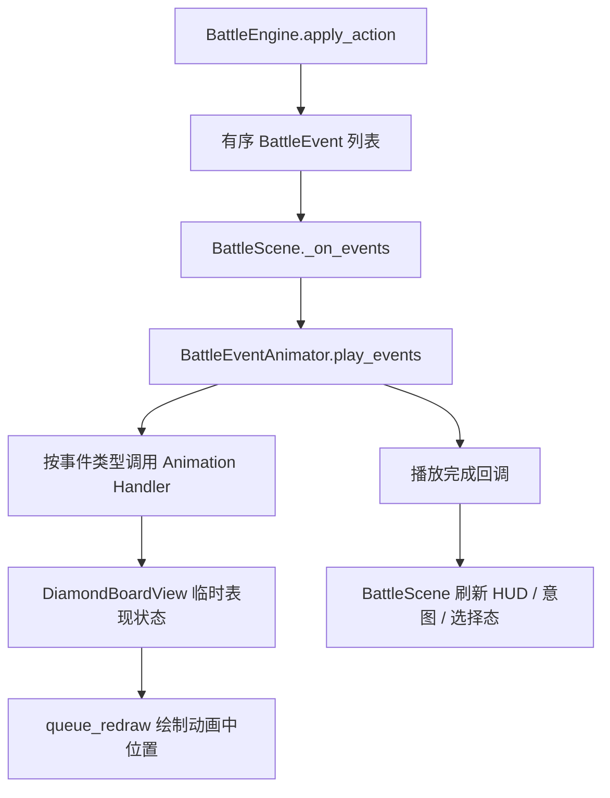
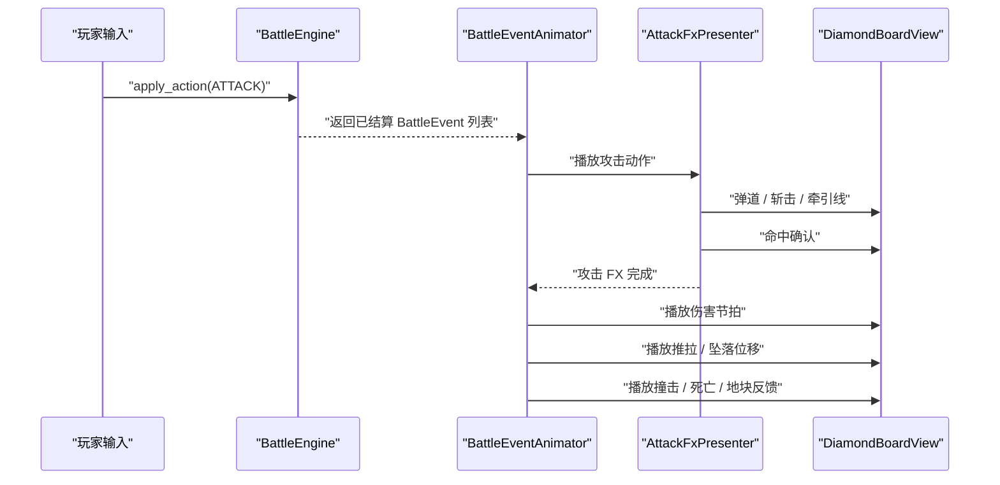

# 战斗事件动画流水线设计

> 日期：2026-06-16  
> 范围：战斗事件播放、单位移动动画、敌方逐步行动表现、后续动画流程扩展。  
> 结论：采用 **事件动画流水线层** 。保持 `BattleEngine` 作为状态真源，在视图层新增可扩展的事件动画调度与棋盘临时表现状态。

## 1. 背景

当前战斗规则已经按文档执行：`BattleEngine` 会生成有序的 `BattleEvent` 列表，`BattleScene._play_events()` 也按顺序 `await` 每个事件。

问题出在表现层：`PhysicsResolver.resolve_move()` 会立刻把 `Unit.position` 改到最终格，`DiamondBoardView` 又直接从最终 `state` 绘制单位。于是 `_anim_unit_moved()` 和 `_anim_unit_pushed()` 即使按顺序调用，也只是重绘最终状态，看起来像直接刷新。

本次重构目标不是只补一个 `Tween`，而是建立一个后续可扩展的战斗事件动画入口，让移动、推动、出怪、攻击、受击、死亡、镜头反馈等表现都能挂到同一套流程上。

## 2. 目标

1. 玩家移动、敌人移动、推动位移都必须显示滑动动画。
2. 敌人回合开始移动必须按事件顺序逐个播放，符合 `round_flow_and_intent.md` 的流程要求。
3. 敌人位移期间隐藏旧攻击意图，动画完成后刷新新攻击线，避免“红线先跳、棋子后动”。
4. 后续新增动画事件时，不继续膨胀 `BattleScene._play_events()`。
5. 不改变 `BattleEngine`、`PhysicsResolver` 的规则结算语义。

## 3. 非目标

1. 不把单位重构成每个 `Unit` 一个独立场景节点。
2. 不引入完整时间轴编辑器或复杂并行动画组系统。
3. 不修改 AI 决策、伤害结算、推拉真值表。
4. 不做兼容旧版 `GridView`、`UnitView` 的适配层；当前实现以 `DiamondBoardView` 为准。

## 4. 方案对比

| 方案 | 内容 | 优点 | 风险 | 结论 |
|---|---|---|---|---|
| 轻量修补 | 直接在 `BattleScene` 加移动 `Tween` 和 `DiamondBoardView` 位置覆盖 | 改动最小 | 后续攻击、受击、出怪继续堆在 `BattleScene` | 不采用 |
| 事件动画流水线 | 新增专门的事件动画调度层，按事件类型路由到 handler | 扩展性和改动规模平衡 | 需要定义清晰接口 | **采用** |
| 完整表现系统 | 拆出事件队列、动画 command、表现状态、镜头层、并行动画组 | 长期能力最强 | 当前改动过大，容易影响已有 UI | 暂不采用 |

## 5. 架构



### 5.1 `BattleEventAnimator`

新增视图层类，建议路径：`scripts/view/battle_event_animator.gd`。

职责：

1. 接收 `BattleScene`、`DiamondBoardView`、`HUD` 等必要依赖。
2. 对外提供 `play_events(events: Array) -> void`。
3. 内部按事件顺序调用 handler，并 `await` 每个 handler 完成。
4. 管理通用动画参数，例如移动时长、推动时长、受击节拍。
5. 提供单点扩展：新增事件类型时新增 `_play_xxx(event)`，不再散落到 `BattleScene`。

### 5.2 `DiamondBoardView` 临时表现状态

`DiamondBoardView` 增加单位绘制覆盖接口：

```gdscript
func set_unit_visual_position(unit_id: int, pos: Vector2) -> void
func clear_unit_visual_position(unit_id: int) -> void
func clear_unit_visual_positions() -> void
```

绘制单位时：

1. 默认仍使用 `unit.position`。
2. 如果存在 `unit_id` 的临时像素位置，则用临时位置绘制。
3. 动画结束后清除临时位置，回到最终 `state` 绘制。

这样可以保留当前 `_draw()` 架构，不需要把单位拆成节点，也不会改变规则状态。

### 5.3 移动动画

`UNIT_MOVED` 和 `UNIT_PUSHED` 使用同一套位置插值能力，但保留不同 handler，方便后续差异化：

| 事件 | 默认时长 | 表现 |
|---|---:|---|
| `UNIT_MOVED` | 0.30 秒 | 从 `from_pos` 滑到 `to_pos`，使用先慢后慢的缓动 |
| `UNIT_PUSHED` | 0.24 秒 | 从 `from_pos` 滑到 `to_pos`，后续可加冲击感 |
| `UNIT_FELL` | 0.28 秒 | 从 `from_pos` 滑向 `to_pos`，结尾可淡出或下坠 |

动画过程不修改 `Unit.position`，只更新 `DiamondBoardView` 的临时像素位置。

### 5.4 攻击与受击节拍

首版使用 `AttackFxPresenter` 统一管理攻击动作和命中确认，入口由 `BattleEventAnimator` 调度：

1. `ENEMY_ATTACK_STARTED`：设置当前执行敌人，棋盘和 HUD 聚焦该敌人。
2. `ENEMY_ATTACK_MISSED`：保留短节拍，显示敌人确实执行了攻击槽。
3. `UNIT_DAMAGED`：刷新棋盘并等待短节拍。
4. `UNIT_DIED` / `UNIT_REMOVED`：刷新并等待短节拍。

后续如果要加入刀光、弹道、震屏、伤害数字飞出，都只扩展对应 handler。

玩家攻击需要额外遵守攻击 FX 前置规则：

1. `BattleScene` 在玩家执行 `BattleAction.attack()` 时记录攻击上下文。
2. `BattleEventAnimator` 收到本次攻击产生的首个命中类事件时，先请求攻击 FX。
3. 攻击 FX 先播放攻击动作，例如近战斩击、远程弹道、斥力弹或牵引线。
4. 攻击 FX 执行态临时隐藏常驻敌人意图线，避免把回合读图线误读成攻击弹道。
5. 攻击 FX 再播放命中确认，例如目标格闪框、火花或短顿帧。
6. 攻击 FX 结束后恢复意图层，并清理所有临时 FX layer。
7. 命中确认结束后，`BattleEventAnimator` 才继续播放 `UNIT_DAMAGED`、`UNIT_PUSHED`、`BUMP_WALL`、`BUMP_UNIT`、`UNIT_DIED`、`UNIT_FELL`、`TILE_DAMAGED` 等结果事件。

这条顺序避免“结果先露出，动画再把单位拉回旧位置重播”的倒放感。攻击动作只表达攻击路径和方向，不直接改变单位逻辑位置；单位位移仍由后续位移事件负责。

## 6. 数据流

1. 玩家点击行动或系统推进回合。
2. `BattleEngine` 立即完成规则结算，返回有序事件流。
3. `BattleScene` 进入 `_animating = true`，清理预演和选择态。
4. `BattleEventAnimator` 顺序播放事件。
5. 位移事件播放期间，`DiamondBoardView` 使用临时像素位置绘制单位。
6. 事件流播放完成后，清除所有临时表现状态。
7. `BattleScene` 从最终 `engine.state` 刷新棋盘、HUD、敌方意图、悬停预演。

玩家攻击事件流的推荐播放顺序：



如果事件流中包含敌方单位位移，旧敌方意图仍按 §8 先隐藏，位移动画完成后再从最终 `engine.state` 重建。

## 7. 接口边界

### 7.1 `BattleScene` 保留职责

1. 输入绑定。
2. 调用 `engine.apply_action()`。
3. 管理选择态、上膛技能态、悬停预演。
4. 在动画完成后刷新整体 UI。

### 7.2 `BattleEventAnimator` 承担职责

1. 事件到动画 handler 的路由。
2. 动画时长和节拍管理。
3. 位移、攻击开始、攻击落空、受击、死亡等事件表现。
4. 调用 `BattleScene` 暴露的必要刷新 / 聚焦方法，或通过轻量回调完成。

### 7.3 `DiamondBoardView` 承担职责

1. 绘制棋盘最终状态。
2. 在存在临时表现状态时覆盖单位绘制位置。
3. 不理解战斗规则，不直接消费 `BattleEvent`。

## 8. 敌方意图刷新规则

敌方单位发生 `UNIT_MOVED`、`UNIT_PUSHED` 或 `UNIT_FELL` 时：

1. 播放事件前隐藏旧敌方意图和行动栈。
2. 位移动画期间不刷新攻击线。
3. 整个事件流播放完成后，从最终 `engine.state` 重建敌方意图。

这延续当前 `_suppress_enemy_intents_until_events_done` 的设计，只把具体动画播放从 `BattleScene` 移到 `BattleEventAnimator`。

## 9. 测试策略

### 9.1 单元测试

新增或扩展 `scripts/tests/test_battle_flow_ui.gd`：

1. `DiamondBoardView.set_unit_visual_position()` 后，内部覆盖表存在对应单位。
2. `clear_unit_visual_position()` 后，覆盖表清除。
3. `BattleEventAnimator` 收到 `UNIT_MOVED` 时，会调用棋盘临时位置接口并在结束后清除。
4. 敌方位移事件仍触发意图延迟刷新逻辑。

### 9.2 事件顺序回归

保留现有测试：

1. `test_spawn_move_events.gd` 验证出怪事件先于移动事件。
2. `test_round1_archer_moves.gd` 验证敌人回合开始会产生移动事件。
3. `test_battle_flow_ui.gd` 验证敌方意图行和推开后的攻击槽逻辑。

### 9.3 手动验证

在 Godot 中跑一局战斗：

1. 玩家移动守卫者时，棋子应从旧格滑到新格。
2. 回合开始敌人移动时，应逐个滑动，不应同时瞬移。
3. 玩家攻击推开敌人时，旧攻击线先隐藏，敌人滑动完成后新攻击线出现。
4. 敌人攻击落空时，行动栈应有短暂停留，不应静默跳过。
5. 玩家远程攻击时，应先看到弹道 / 牵引线，再看到目标受击和位移。
6. 玩家攻击导致位移时，不应出现目标先显示在最终格、再回旧格播放位移的倒放感。

## 10. 实施步骤

1. 在 `DiamondBoardView` 增加单位临时像素位置覆盖接口，并让 `_draw_unit()` 使用覆盖位置。
2. 新增 `BattleEventAnimator`，先迁移 `UNIT_MOVED`、`UNIT_PUSHED`、`UNIT_FELL` 的动画播放。
3. 把 `BattleScene._play_events()` 改为委托给 `BattleEventAnimator`，保留 `BattleScene` 的状态刷新收尾。
4. 接入攻击 FX 前置播放入口，保证攻击动作 / 命中确认先于结果反馈。
5. 迁移现有攻击开始、攻击落空、受击、死亡、移除、地块变化节拍。
6. 增加测试覆盖临时位置覆盖、事件动画入口和攻击 FX 前置时序。
7. 运行现有 GDScript 测试，最后在 Godot 编辑器或游戏场景中做手动验证。

## 11. 完成标准

1. `UNIT_MOVED`、`UNIT_PUSHED`、`UNIT_FELL` 不再表现为瞬移。
2. 敌人回合开始移动按事件顺序逐个可见播放。
3. 动画结束后棋盘与 `engine.state` 一致，没有残留临时位置。
4. 敌方意图不会在敌方位移动画中提前跳变。
5. 玩家攻击先播放攻击动作 / 命中确认，再播放伤害、位移和死亡等结果反馈。
6. 攻击执行态不会显示成地板预演：弹道、牵引和斩击使用棋盘上方锚点，常驻意图线在执行态临时隐藏。
7. 新增动画事件只需要在 `BattleEventAnimator` 增加 handler，不需要继续扩大 `BattleScene`。
