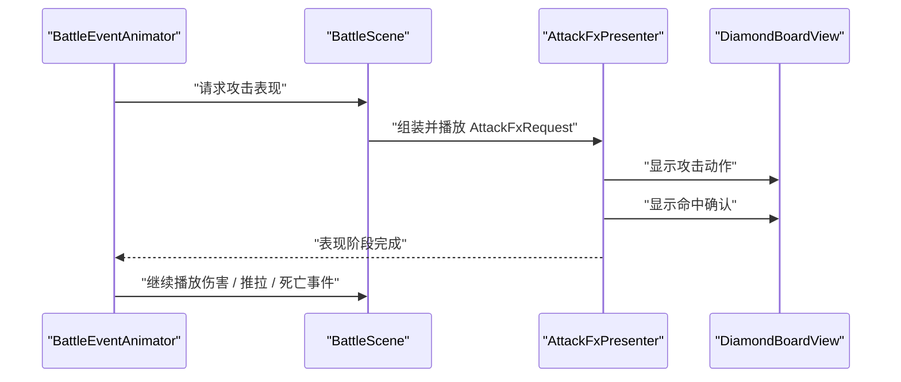
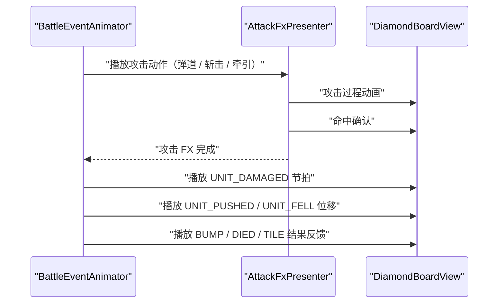

# 棋盘攻击特效拆分与重构设计

## 背景

当前战斗棋盘使用 Godot **4.6** ，核心表现链路如下：

- `BattleEngine` 产出已经结算完成的 `BattleEvent`。
- `BattleEventAnimator` 按顺序播放事件动画，并通过 `await` 控制表现节奏。
- `BattleScene` 负责连接引擎、HUD、棋盘视图和动画辅助逻辑。
- `DiamondBoardView` 负责棋盘坐标转换、敌方意图、单位绘制和当前攻击 FX layer 绘制。

第一版攻击反馈已经解决了可读性问题：敌人意图线常驻，攻击执行时会在来源格与目标格之间绘制高亮线、目标框和命中火花。旧实现的问题不是效果完全不可用，而是攻击表现被拆散在多个类里：

- `BattleScene` 记录 pending player attack context 并直接控制表现时长。
- `BattleEventAnimator` 直接调用 scene 的攻击表现 hook。
- `DiamondBoardView` 同时拥有攻击 FX 状态、生命周期和绘制细节。

如果继续在这些位置叠加弹道、斩击、推拉冲击波和资源化特效，后续会难以扩展，也容易影响事件播放顺序。

## 目标

本次设计目标是把攻击表现拆成清晰、可扩展的视图层管线：

1. 保留 Into the Breach 风格的战术可读性。
2. 将攻击表现拆成 **攻击预告** 、 **攻击动作** 、 **命中确认** 、 **结果反馈** 四个阶段。
3. 新增独立的攻击 FX presenter，让攻击表现生命周期不再散落在 `BattleScene` 和 `DiamondBoardView`。
4. 第一阶段保持现有视觉效果不变，只做边界抽离。
5. 后续可以按 `UnitDef.AttackKind` 扩展近战、远程、推、拉等不同动作表现。
6. 保持战斗规则、AI 和 `BattleEvent` 语义不变。

## 非目标

本设计不包含以下内容：

- 不修改 `BattleEngine` 的战斗结算。
- 第一阶段不新增 `BattleEvent.Type`。
- 第一阶段不引入粒子系统或屏幕震动。
- 音频反馈使用轻量程序化 one-shot，不依赖外部音频资源。
- 攻击 FX 可以使用小型受控图集，但不引入 AI 生成的大幅图、复杂粒子系统或高细节手绘特效。
- 不重写 HUD、输入系统或敌方 AI。
- 不把表现层做成第二套战斗规则解释器。

## 推荐方案

采用 **分阶段抽离** ，而不是一次性全量重写。

推荐新增 `AttackFxPresenter`，把攻击动作和命中确认的生命周期从 `BattleScene` 中移出，并逐步拆出四个阶段。这样可以在不破坏现有战斗表现的前提下，建立后续扩展弹道、斩击和资源化特效的边界。

## 架构拆分

### `BattleEventAnimator`

`BattleEventAnimator` 继续负责事件播放顺序和 `await` 时机。它是当前最适合维护表现顺序的类，因为它已经逐个处理 `BattleEvent`，并且知道什么时候应该先播放攻击确认，再播放伤害、推拉、死亡和地块变化。

它不应该知道具体绘制细节，只调用高层表现接口，例如：

```gdscript
await _scene.play_attack_fx_for_event(event)
```

### `BattleScene`

`BattleScene` 保留桥接职责：

- 创建并持有 `AttackFxPresenter`。
- 根据当前 action、事件和单位状态组装攻击表现请求。
- 维护敌人执行焦点、HUD 状态和输入阻塞。
- 将 board view、unit lookup 等上下文提供给 presenter。

它不再直接管理攻击 FX layer 和具体持续时长。

### `AttackFxPresenter`

`AttackFxPresenter` 是新增的视图层组件，负责攻击表现生命周期和阶段调度。

第一阶段职责：

- 接收攻击请求。
- 调用 `DiamondBoardView` 显示攻击动作和命中确认 layer。
- 等待当前持续时间。
- 清理攻击效果。

后续阶段职责：

- 根据 `UnitDef.AttackKind` 选择 FX profile。
- 播放攻击动作，例如近战斩击、远程弹道、拉拽锁链、推力波。
- 播放命中确认。
- 在结果事件播放前后追加轻量结果反馈。
- 预留 Resource / PackedScene 配置入口，用于替换或扩展图集 sprite。

### `DiamondBoardView`

`DiamondBoardView` 保留棋盘绘制能力：

- `cell_to_pixel()` / `pixel_to_cell()` 坐标转换。
- 读取小型 FX atlas，并绘制弹体、斩击、火花、冲击环、牵引线等 sprite。
- 在资源缺失时绘制线、箭头、菱形框、弧线、火花、冲击波等 primitives 作为兜底。
- 绘制敌方意图和棋盘实体。

它不拥有攻击 FX 生命周期，只提供 `set_attack_fx_layers()` / `clear_attack_fx_layers()` 作为 presenter 的渲染接口。FX layer 至少包含 `phase`、`from_cell`、`to_cell`、`attack_kind`、`direction` 和可选 `progress`。

## 攻击表现阶段

### 1. 攻击预告

攻击预告是常驻战术信息层，主要用于敌方意图：

- 来源格到目标格的威胁线。
- 目标格危险框。
- 敌人来源标记和行动顺序。
- HUD 敌人行动栈联动。

这一层强调可读性，不应该被短促攻击动作完全覆盖。

### 2. 攻击动作

攻击动作是“攻击真的发生了”的动态表现。后续按 `UnitDef.AttackKind` 映射：

- `MELEE_PUSH`：近战斩击弧线 + 推击方向波纹。
- `MELEE_BUMP`：短促接触冲击，不强调位移。
- `RANGED_PUSH`：从来源到目标的短促攻击刻痕或斥力线。
- `RANGED_PULL`：来源到目标的牵引线，并强调目标向来源方向被拉。

这一层应该短、清楚、有方向性，不追求大范围粒子。

#### 2.1 攻击过程动画

攻击过程动画用于填补“攻击声明”到“命中确认”之间的动态演出，目标是接近 **Into the Breach** 的战术可读性：动作短、方向明确、不会遮挡长期威胁信息。

推荐规则：

1. 攻击动作必须先于结果反馈播放。玩家应该先看到攻击者发起动作，再看到目标受伤、位移、撞击或死亡。
2. 攻击动作只表达“攻击从哪里来、打向哪里”，不负责移动单位到结果位置。
3. 攻击动作不能把目标从最终状态倒拉回旧格，也不能让玩家误解敌人重新执行了回合开始移动。
4. 攻击动作可以使用临时视觉对象或 board primitive，但必须在动作结束后清理。
5. 攻击动作时长按攻击类型配置：远程弹体约 `0.36s`，牵引约 `0.40s`，近战约 `0.32s`，命中确认约 `0.30s`。如果要接近 **Into the Breach** 的重量感，优先调整 `AttackFxPresenter` 中的阶段时长，不要通过结果事件插入额外等待。
6. 攻击执行态可以临时隐藏常驻敌人意图线，避免红色威胁线被误读成攻击弹道。执行结束后必须恢复正常意图展示。

不同攻击类型的第一版表现：

| 攻击类型 | 过程动画 | 命中连接 |
|---|---|---|
| `MELEE_PUSH` | 攻击者格到目标格的短斩击弧线，目标方向出现推击波纹 | 目标格闪框 + 推方向火花 |
| `MELEE_BUMP` | 攻击者格到目标格的短接触冲击，强调近距离碰撞 | 目标格闪框 + 小范围撞击火花 |
| `RANGED_PUSH` | 从攻击者上方扫向目标上方的短线 / 刻痕，带轻微拖尾和目标准星 | 目标格闪框 + 沿推方向扩散的冲击波 |
| `RANGED_PULL` | 攻击者与目标之间的牵引线 / 钩索，线条从攻击者伸到目标 | 目标格闪框 + 朝攻击者方向收束的拖影 |

当前实现采用 **分段 flipbook 小资源 + 程序化战术控制** 的 ITB 式方案：`art/effects/battle_attack_vfx_sheet.png` 提供 muzzle、projectile、impact、dust、slash、tether 等轻量帧序列，`DiamondBoardView` 负责把这些资源按棋盘上方锚点绘制成出手点、断续扫痕、准星、星芒和推拉方向波。`AttackFxPresenter` 负责把一次攻击拆成 `muzzle`、`projectile` / `slash` / `tether`、`impact`、`dust` 等阶段。资源承载主要视觉形态；代码负责空间端点、方向、时长、旋转、缩放、透明度、叠放顺序和清理；特效不承载战斗逻辑，也不使用大幅 AI 绘制图。

默认美术方向是 **暗铁琥珀战术符号** ：攻击主色使用当前 UI 已有的琥珀、暗红、骨色高光和黑描边。远程攻击不做一个清晰可辨的物件飞过棋盘，而是表现为短促能量刻痕、分段轨迹线和目标准星；命中使用星芒、中心点和方向波确认。通用攻击不使用高饱和青绿色；青绿色只保留给裂隙、法术或特殊敌人 profile。

攻击 FX 的主视觉统一绘制在地板上方的悬浮层，而不是贴着格子中心绘制。当前实现拆成三段高度：

| 常量 | 用途 |
|---|---|
| `DiamondBoardView.ATTACK_FX_MUZZLE_HEIGHT` | 出手点，靠近棋子身体上方，用于弹体、牵引线和近战挥击起点 |
| `DiamondBoardView.ATTACK_FX_TARGET_HEIGHT` | 命中前的空中目标点，用于弹体落点、牵引终点和斩击中心 |
| `DiamondBoardView.ATTACK_FX_HEIGHT` | 命中确认点，用于 spark、ring 和目标格上方的短促确认 |

地面目标框、长期敌人意图线和攻击执行 FX 是不同层级。常驻意图线属于回合读图层；`AttackFxPresenter` 播放攻击时会临时打开 `DiamondBoardView.set_attack_fx_suppresses_intents(true)`，让执行态只保留攻击本身和命中确认，避免看起来像地板预演。

- 出手：从攻击者身体上方播放 `muzzle` 短帧序列，给玩家一个明确的发射起点。
- 弹道：`RANGED_PUSH` 默认使用 `projectile` 帧序列绘制断续扫痕，从 `from_cell` 的 muzzle anchor 扫向 `to_cell` 的 target anchor，带轻微弧线、暗铁描边和短尾迹；程序绘制只作为资源缺失时的兜底。`projectile` 不应读成实体箭矢、子弹或飞行物。
- 斩击：`slash` 帧序列在目标格上方按攻击方向旋转，必要时叠加方向火花。
- 牵引：`tether` 帧序列从攻击者上方分段铺到目标上方，结尾用内收光点提示拉拽方向。
- 推击波：在目标格上方到推方向的半格范围绘制短促波纹。
- 命中：目标格上方先显示准星和六向星芒，再按推拉方向播放短促波纹；`impact` 六帧序列保持同风格星芒资源，`dust` 六帧序列仅做低透明落点刻痕，不做大团烟尘。
- 音效：`BattleSfxPresenter` 为攻击动作和命中确认播放短促程序化 one-shot，按 `attack_kind` 区分近战、远程推、远程拉和命中质感。

这种做法接近 **Into the Breach** 常见的表现结构：少量清晰 sprite 负责读图符号，真正的节奏、方向和强弱由代码动画控制。后续如果需要更换风格，只替换 atlas 或 profile，不需要改战斗结算。

这些过程动画属于攻击 FX，不是 `BattleEvent` 结果本身。真正的单位位移仍由后续 `UNIT_PUSHED` / `UNIT_FELL` 结果反馈播放。

### 3. 命中确认

命中确认负责告诉玩家“目标被攻击命中”：

- 目标格高亮框。
- 内部菱形亮片。
- 短促 hit sparks。
- 必要时可加入目标单位一帧白/红闪。

旧版攻击闪光中的目标框、亮片和火花可以迁移为这一层的第一版实现。

### 4. 结果反馈

结果反馈展示战斗事件的后果：

- `UNIT_DAMAGED`：受击 / HP 变化。
- `UNIT_PUSHED`：单位位移。
- `BUMP_WALL` / `BUMP_UNIT`：撞击反馈。
- `UNIT_DIED` / `UNIT_FELL`：死亡或坠落。
- `TILE_DAMAGED` / `TILE_DESTROYED`：建筑或地块受损。

第一阶段继续复用现有事件动画。后续可以在 presenter 中增加轻量过渡，但不能改变事件顺序。

结果反馈必须遵守两个边界：

1. 如果攻击动作已经播放了弹道、斩击或牵引线，结果反馈只展示后果，不重复播放第二次完整攻击动作。
2. 如果目标发生位移，位移动画应从攻击命中时的格子滑向结果格，不应先露出结果格、再回退到旧格重新播放。

## 数据契约

第一阶段可以使用轻量字典，避免过早引入复杂 Resource：

```gdscript
var request := {
    "attacker_id": attacker_id,
    "target_id": target_id,
    "from_cell": from_cell,
    "to_cell": to_cell,
    "attack_kind": attack_kind,
    "is_player_attack": is_player_attack,
    "affected_cells": affected_cells,
    "direction": direction,
    "result_events": result_events,
}
```

字段说明：

| 字段 | 用途 |
|---|---|
| `from_cell` / `to_cell` | 攻击动作和命中确认的空间端点 |
| `attack_kind` | 选择弹道、斩击、牵引或接触冲击 profile |
| `direction` | 推、拉、冲击波和火花方向 |
| `affected_cells` | 命中确认或范围提示所需格子 |
| `result_events` | 只读结果事件摘要，用于决定是否需要推击波、坠落提示或死亡强调 |

`AttackFxPresenter` 可以读取这些字段选择表现，但不能修改 `BattleState`，也不能重新判断攻击是否合法。

## 资源契约

默认攻击资源为 `art/effects/battle_attack_vfx_sheet.png`。它是一张透明背景 flipbook sheet，固定 `6 x 6` 个 `96px` 单元。每一行是一类短帧序列，列为从左到右的播放帧。当前定义如下：

| 行 | 名称 | 帧数 | 用途 |
|---|---|---:|---|
| `0` | `muzzle` | `4` | 出手口火花 / 短烟，标明攻击从单位身上发出 |
| `1` | `projectile` | `4` | 远程推击的断续扫痕 / 分段刻痕，资源绘制主体，程序控制路径和透明度 |
| `2` | `impact` | `6` | 命中星芒 / 中心确认点 |
| `3` | `dust` | `6` | 命中后的低透明落点刻痕 |
| `4` | `slash` | `5` | 近战斩击帧 |
| `5` | `tether` | `4` | 拉拽牵引线分段 |

这些序列是独立动画片段，但仍不决定攻击是否命中、造成多少伤害或推动到哪里。旋转、移动、缩放、透明度和播放时长由 `AttackFxPresenter` 与 `DiamondBoardView` 根据 FX layer 控制。后续若需要重击、暴击、元素或 Boss 攻击，优先新增 profile 和序列行，而不是回退到单帧符号拼贴。

修改边界：

- 想新增攻击流程：在 `BattleEventAnimator` 或 `BattleScene` 组装新的 FX request，再由 `AttackFxPresenter` 调度阶段。
- 想新增视觉类型：在 `DiamondBoardView` 增加 sequence 行、帧数和绘制方法，必要时扩展 sheet。
- 想调整动画时间：优先改 `AttackFxPresenter.MUZZLE_DURATION`、`PROJECTILE_DURATION`、`MELEE_ACTION_DURATION`、`TETHER_ACTION_DURATION` 和 `IMPACT_DURATION`，不要改战斗事件；敌人位移速度优先改 `BattleEventAnimator.MOVE_DURATION` / `PUSH_DURATION` / `FALL_DURATION`。
- 想调整攻击高度：优先改 `DiamondBoardView.ATTACK_FX_MUZZLE_HEIGHT`、`ATTACK_FX_TARGET_HEIGHT` 和 `ATTACK_FX_HEIGHT`，不要把弹道重新贴回 `cell_to_pixel(cell)`。
- 想换美术风格：替换同尺寸 sheet 或引入 `AttackFxProfile`，保持 layer 数据契约不变。

后续如果需要更强类型，可以升级为 `AttackFxRequest extends RefCounted`。如果需要美术配置，可以再引入 `AttackFxProfile extends Resource`：

```gdscript
class_name AttackFxProfile extends Resource

@export var action_kind: StringName
@export var action_duration: float = 0.18
@export var impact_duration: float = 0.12
@export var primary_color: Color
@export var action_scene: PackedScene
@export var impact_scene: PackedScene
```

第一阶段不要求创建 profile 资源，只保证接口未来可以承接。

## 时序设计

推荐播放顺序：



敌方攻击：

1. `ENEMY_ATTACK_STARTED` 到达。
2. `BattleScene` 设置执行敌人焦点。
3. `AttackFxPresenter` 播放攻击动作和命中确认。
4. `BattleEventAnimator` 继续播放后续结果事件。

玩家攻击：

1. 玩家执行 `BattleAction.attack()` 时，`BattleScene` 记录本次攻击上下文。
2. 当首个命中 / 推拉 / 地块变化事件到达时，`BattleEventAnimator` 请求 presenter 播放攻击动作。
3. Presenter 播放命中确认。
4. 播放完成后清理 pending attack context。
5. `BattleEventAnimator` 继续播放后续伤害、推拉、撞击、死亡和地块变化事件。

玩家攻击包含位移时，推荐视觉顺序是：



这条顺序的关键是：玩家先看到攻击发生，再看到结果发生。不能先显示目标最终位置，再把目标拉回命中格播放位移。

## 迁移计划

### 阶段 1：边界抽离

- 新增 `scripts/view/attack_fx_presenter.gd`。
- 将攻击动作、命中确认、等待、清理封装到 presenter。
- `BattleScene` 不再暴露旧攻击闪光 hook，只保留攻击 FX 请求组装入口。
- `DiamondBoardView` 使用 `set_attack_fx_layers()` / `clear_attack_fx_layers()` 渲染过程动画和命中确认。
- 攻击 FX layer 使用 `from_cell` / `to_cell` / `attack_kind` / `direction` / `progress` 描述空间和进度，不携带规则结算。

### 阶段 2：阶段命名

- 将攻击 FX layer 拆成明确的 action / impact 状态。
- 保持敌方意图层独立，不与执行 FX 混合。
- 在 presenter 中暴露 `play_attack_action()`、`play_impact_confirmation()` 等内部方法。
- 为 `RANGED_PUSH` / `RANGED_PULL` 增加轻量过程动画状态，例如 attack trace progress、beam progress 或 tether progress。

### 阶段 3：按攻击类型扩展

- 为 `MELEE_PUSH` 增加斩击 / 推击波。
- 为 `MELEE_BUMP` 增加短促碰撞反馈。
- 为 `RANGED_PUSH` 增加短线刻痕或斥力线。
- 为 `RANGED_PULL` 增加牵引线和回拉方向提示。
- 为各攻击类型接入轻量程序化 one-shot 音效。

### 阶段 4：资源化扩展

- 保持 `art/effects/battle_attack_vfx_sheet.png` 作为默认分段 flipbook sheet。
- 引入 `AttackFxProfile` Resource。
- 允许 profile 覆盖颜色、时长和可选 `PackedScene`。
- 如需要美术资源，优先产出低细节、固定切片、透明背景的短帧序列，而不是大幅 AI 绘制图或单帧符号拼贴。

## 风险与约束

- 如果 `AttackFxPresenter` 开始推断伤害、位移或命中规则，它会变成第二套战斗逻辑。必须只消费已知事件和单位状态。
- 如果 `DiamondBoardView` 继续拥有攻击 FX 生命周期，重构会变成表面抽离，扩展性不会改善。
- 如果第一阶段直接上复杂资源和粒子，容易在 API 稳定前造成返工。小型 atlas 可以进入默认实现，但必须保持切片稳定和表现克制。
- 如果命中确认和结果反馈再次混在一起，远程推、远程拉和近战撞击会继续难以区分。

## 验收标准

阶段 1 完成后应满足：

1. 玩家攻击和敌方攻击的视觉表现与当前版本一致。
2. 攻击动作和命中确认生命周期由 `AttackFxPresenter` 管理。
3. `BattleEventAnimator` 的事件播放顺序不变。
4. `BattleEngine`、`BattleState` 和 `BattleEvent` 语义不变。
5. 攻击 FX 结束后不会残留棋盘状态。
6. Godot headless 启动和现有测试通过。

阶段 3 完成后应满足：

1. 近战和远程攻击在动作层有清晰差异。
2. 推和拉的方向性可读。
3. 命中确认仍然短促，不遮挡长期战术信息。
4. 敌方攻击预告在动画期间仍保持 ITB 风格的可读性。

## 测试建议

实现后需要验证：

- 玩家近战攻击敌人。
- 玩家远程攻击敌人。
- 玩家攻击建筑或可破坏地块。
- 敌方近战攻击守卫者。
- 敌方远程攻击建筑。
- 推击导致撞墙或撞单位。
- 拉拽导致目标位移。
- 攻击落空时不显示误导性的命中确认。
- 远程攻击先播放弹道 / 牵引线，再播放受击和位移。
- 玩家推开敌人时不出现“目标先在最终格、再回旧格重播”的倒放感。
