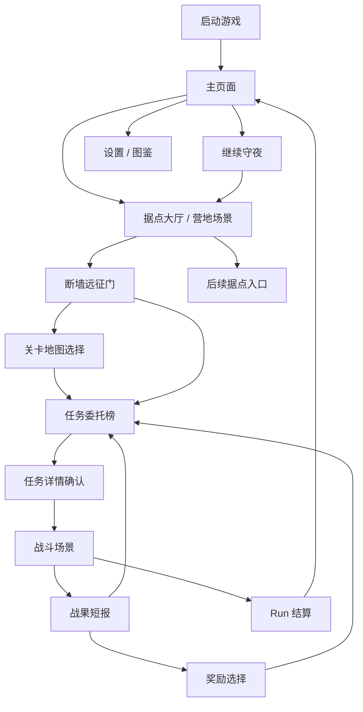

# 主页面与据点任务场景设计

> 日期：2026-06-16  
> 状态：已按当前实现更新  
> 范围：启动主页面、进入游戏后的据点大厅、断墙远征门里的关卡地图选择、断墙远征门任务委托榜，以及与现有战斗场景的视觉衔接。  
> 结论：采用 **主页面 -> 据点场景 -> 断墙远征门 -> 关卡地图选择 -> 任务委托榜 -> 战斗** 的结构。主页面先进入主场景；断墙远征门在未建 Run 时负责选择本局关卡地图，已有 Run 时负责局内下一任务选择。

## 1. 背景

当前启动后第一屏由 `scripts/core/game_manager.gd` 的 `_show_main_menu()` 运行时创建。旧版本主要由两个说明型面板组成：左侧是标题和按钮，右侧是“本次实现流程”等 Demo 说明。这个结构能验证 Run 闭环，但不符合正式游戏的第一印象。

用户期望参考《黑暗地牢》的体验：先看到正式主页面，进入游戏后不是直接进入文档式路线图，而是进入一个有场景感的黑暗据点 / 营地。在该场景里，玩家通过任务布告、远征门等场景热点选择任务。

## 2. 设计目标

1. 去掉启动页的 Demo 味道，让第一屏像正式游戏入口。
2. 把新 Run 的区域选择从任务委托中剥离，但仍放在主场景的 `断墙远征门` 入口下。
3. 把局内下一任务选择从主页面中剥离，放到进入游戏后的据点场景里。
4. 用据点场景承载断墙远征门和后续营地、工坊、图鉴、设置、商店等扩展入口。
5. 复用当前 Godot 工程的 Run 和战斗数据，不改变战斗规则。
6. 统一主页面、据点、关卡地图选择、任务选择和战斗 HUD 的暗黑战术视觉语言。
7. 保持战斗棋盘可读性，装饰不能遮挡格子、意图线和行动顺序。

## 3. 页面流

第一版实现主链路：`主页面 -> 据点场景 -> 断墙远征门 -> 关卡地图选择 -> 任务委托榜 -> 战斗场景 -> 战果短报 -> 奖励选择 / 任务委托榜`。普通战斗不再进入独立大结算页；战斗后先出现一张轻量战果短报，胜利从短报进入奖励选择，非终局失败从短报回到任务委托榜并展示一条战果提示，Run 失败或通关才进入 Run 结算。营地、工坊、图鉴和设置入口暂不在据点首页露出，避免据点页退化成按钮大厅。

## 4. 主页面设计

### 4.1 目的

主页面负责建立游戏气质，并提供少量入口。它不解释当前 Demo 实现，不展示路线规则，不承担任务选择。

### 4.2 布局

- 背景：暗红黑色调的主视觉，可使用守卫者剪影、裂隙火光、废墟轮廓或远处据点轮廓。
- 左侧或中左：游戏标题 `裂隙守夜`。
- 标题下方：一句短标语，例如 `守住最后的火光，选择下一次远征`。
- 左下：主菜单按钮纵向排列。
- 右侧：角色剪影或据点轮廓，不放功能说明文字。
- 所有交互按钮保留在 90% 标题安全区内。

### 4.3 按钮

| 按钮 | 显示条件 | 行为 |
|---|---|---|
| 继续守夜 | 有未结束 Run 时启用 | 进入据点，并恢复当前任务 / 结算状态 |
| 开始新局 | 始终显示 | 进入据点主场景；若已有 Run，先弹出覆盖确认 |
| 图鉴 | 始终显示 | 第一版可占位 |
| 设置 | 始终显示 | 第一版可占位 |
| 退出 | 桌面版显示 | 退出游戏 |

### 4.4 文案规则

- 不出现 `Demo Run`、`本次实现流程`、`当前验证` 等开发态文案。
- 不使用长段规则说明。
- 主按钮动词要明确，例如 `继续守夜`、`开始新局`。

## 4.5 断墙远征门的关卡地图选择

关卡地图选择只在据点场景中通过 `断墙远征门` 打开。它回答“这一局去哪个区域”，不承担局内任务选择。

`开始新局` 不直接打开地图桌，而是先进入据点。玩家在主场景中点击 `断墙远征门` 后，才看到关卡地图选择。

第一版使用区域地图式布局，而不是任务卡或节点连线图：

| 区域 | 定位 | 说明 |
|---|---|---|
| 断墙外环 | 标准 / 均衡 | 默认路线，战斗、事件和整备均衡 |
| 裂隙回廊 | 高压 / 成长 | 战斗密度更高，裂隙压力更明显，成长机会更多 |
| 废弃军需线 | 资源 / 补给 | 商店和事件更多，更考验余烬规划 |

玩家选中区域后才生成本局 Run，并直接进入本局任务委托榜。关卡地图选择不显示守护值、队伍 HP、具体任务奖励、节点层级或路线连线，避免玩家把它误认为局内任务面板。

## 5. 据点大厅 / 营地场景设计

### 5.1 目的

据点是进入游戏后的主场景，承担任务选择和长期功能入口。玩家应感觉自己进入了一个可操作的黑暗据点，而不是进入了一个普通菜单。

据点页不承担战斗内信息面板职责。它只回答三个问题：

1. 我现在在哪里。
2. 这里有哪些可交互的地点。
3. 下一步从哪里进入具体决策。

战斗 HUD、队伍状态细节、任务风险和局内结算字段不能前置到据点首页。尤其是 `守护值`、`腐化`、守卫者 HP、回合数、保护目标、敌人意图等信息，只有在对应入口中需要玩家判断时才展示。

### 5.2 功能分层

据点主场景需要支持的内容分为三层：

| 层级 | 内容 | 首页表达 |
|---|---|---|
| 必做入口 | 断墙远征门、返回标题 | 以场景热点和短标签展示 |
| 流程承接 | 战后回到据点、奖励领取后回到据点、事件 / 营地 / 商店处理后回到据点 | 不在首页铺开说明，只保证返回路径成立 |
| 后续扩展 | 守卫者召集处、工坊、图鉴、设置、商店、营地治疗、防线整备、章节结算、下一章预告 | 可作为背景建筑、任务委托特殊内容或后续入口，不抢主链路焦点 |

第一版首页只保留 `断墙远征门` 作为主热点。未创建 Run 时，`断墙远征门` 显示为 `选择关卡地图`；已有 Run 时，显示为 `布告板 / 任务选择`。`守卫者召集处` 暂不显示，等后续明确队伍管理、阵亡补位、招募或复活规则后再作为独立据点节点开放。

不在首页继续增加营地、工坊、商店、图鉴、设置等一排入口，避免据点页退化成按钮大厅。

### 5.3 场景构图

采用 2D 横向舞台式构图：

- 中央：篝火、破败大厅或守卫者归队区域，作为视觉焦点。
- 右侧：断墙远征门，是第一版最重要的可交互入口。
- 左侧：可保留守卫者归队区、篝火或建筑剪影，但当前不作为可点击入口。
- 后景：工坊、钟楼、裂隙、破墙等轮廓，提供世界观。
- 前景：低透明黑色遮罩和地面阴影，保证 UI 面板可读。

### 5.4 场景热点

| 热点 | 第一版状态 | 行为 |
|---|---|---|
| 断墙远征门 | 必做，主入口 | 未建 Run 时打开关卡地图选择；已有 Run 时打开任务委托 / 任务布告 |
| 守卫者召集处 | 后续 | 第一版不显示；后续明确队伍管理规则后再开放 |
| 营地 / 治疗入口 | 后续 | 第一版不强行露出；如果露出，只做占位或进入现有营地节点逻辑 |
| 工坊 | 可占位 | 显示暂未开放 |
| 图鉴 | 可占位 | 进入图鉴占位页 |
| 设置 | 可占位 | 进入设置占位页 |
| 返回标题 | 必做 | 返回主页面；当前远征进度保留 |

热点需要有可见焦点态，不能只靠颜色区别。建议使用描边、轻微火光、悬停标签和鼠标指针变化。

### 5.5 首页常驻信息

据点首页常驻信息要尽量少，优先服务场景识别，而不是数值决策：

| 信息 | 表达 |
|---|---|
| 当前据点名 | `断墙据点`，作为页面标题展示 |
| 简短行动提示 | `整队，确认下一次远征。` |
| 低密度概览 | 可显示 `余烬` 和存活守卫者数量，用于承接上一局状态 |
| 可选世界状态 | 例如“火光渐弱”“远门未启”等短氛围提示；第一版可以不做 |

常驻栏不显示 `守护值`、`腐化`、守卫者 HP 点、敌人压力、任务目标、任务奖励或章节路径细节。这些信息会把据点页变成任务详情页，并削弱场景感。

如果后续发现确实需要在首页提示紧急状态，也应使用入口态表达，例如 `召集处` 高亮、`远征门` 锁定、背景火光变化，而不是在顶部增加一排数值。

### 5.6 截图对应的第一版落地

当前截图中的空间结构可以作为第一版参考，但顶部信息条只能保留低密度概览。首页应保留地点识别和热点选择，不把风险、路线或战斗数值作为常驻信息。

| 区域 | 文案 | 设计意图 |
|---|---|---|
| 顶部概览 | 未建 Run 时显示 `尚未选择关卡地图`；已有 Run 时显示 `余烬`、`守卫者 x / 3` | 承接当前流程状态，不展示局内风险 |
| 页面标题 | `断墙据点` | 明确玩家已经进入据点，不是主菜单或路线图 |
| 页面副标题 | `整队，确认下一次远征。` | 给出当前动作，不解释规则 |
| 右侧热点 | `断墙远征门`、`选择关卡地图` 或 `布告板 / 任务选择` | 未建 Run 时承担关卡地图入口；已有 Run 时承担任务委托选择入口 |
| 底部按钮 | `返回` | 回到标题菜单或返回确认 |

这页不需要显示详细章节名、路径结构、守护值、腐化、敌人预告或任务奖励。未建 Run 时，玩家点击 `断墙远征门` 后选择关卡地图；已有 Run 时，玩家点击 `断墙远征门` 后进入任务委托面板查看可选任务、风险和奖励。`守卫者召集处` 当前不作为可点击地点出现。

## 6. 断墙远征门 / 任务选择设计

### 6.1 入口

已有 Run 时，玩家点击据点中的断墙远征门后打开任务委托面板。面板覆盖在场景中央，背景仍能看到据点，让玩家感觉是在据点内查看布告和出征委托，而不是进入开发态路线图。

### 6.2 任务委托列表

第一版使用当前 Run 的委托榜生成任务卡列表：

- 普通战、精英战、事件、营地、商店、Boss 都包装为不同类型的任务委托。
- 当前可选任务显示为固定数量卡片，卡片上提供任务名、任务类型、风险、压力标签和奖励预览。
- 默认显示 3 个委托槽。完成一个委托后，该槽位立即补入新的可接委托。
- 完成足够数量的非 Boss 委托后，Boss 委托单独出现，玩家不需要清空同一层所有任务。
- 暂不可选内容不在面板中铺开，避免玩家看到一张半成品路径图。
- 前台不展示底层路线连线，也不展示“同层清空”目标。

面板标题使用 `任务委托`。副文案说明据点正在等待不同委托：防守、压制、讨伐、补给或整备。

### 6.3 任务卡字段

| 字段 | 示例 | 说明 |
|---|---|---|
| 任务名 | `铁角闸门` | 来自节点标题 |
| 任务类型 | `防守委托`、`精英讨伐`、`补给委托` | 帮玩家先理解这次要做什么 |
| 风险 | `■■□□□ 2/5` | 作为进入详情前的粗判断 |
| 压力标签 | `裂隙压力`、`堵路拥挤` | 只展示 1 到 2 个关键词 |
| 奖励预览 | `余烬 +7 · 成长机会` | 区分普通战、精英战、Boss、事件、营地、商店 |
| 详情入口 | `查看详情` | 进入委托确认页 |

### 6.4 任务详情确认

点击任务卡后进入详情确认态。详情确认必须显示：

- 任务名和任务类型。
- 敌人或压力提示。
- 回合数和保护目标。
- 可能奖励。
- 当前出战人数、必要的队伍风险和资源摘要。
- 主按钮：`开始任务` 或 `进入战斗`。
- 次按钮：`返回据点`。

高风险任务需要显示明确警告，例如 `当前仅剩 2 名守卫者，进入精英战风险较高`。

## 7. 战斗场景衔接

### 7.1 保留内容

现有战斗场景 `Scenes/battle/BattleScene.tscn`、`scripts/view/battle_scene.gd` 和 `scripts/view/hud.gd` 已经具备：

- 棋盘。
- 顶部状态。
- 守护值。
- 敌方行动顺序栈。
- 守卫者头像和技能栏。
- 奖励任务。
- Boss 状态面板。

第一版不改变战斗规则和行动逻辑。

### 7.2 视觉统一

战斗场景应与主页面和据点统一：

- 主色：黑、深褐、暗红。
- 强调色：火光琥珀、铁锈红、旧金色。
- 面板材质：粗糙木板、旧羊皮纸、锈铁边框。
- 危险信息：红色 + 图标 / 形状备份。
- 可操作信息：金色描边 + 明确焦点态。

### 7.3 可读性约束

- 棋盘、敌方意图、攻击线和行动编号优先级最高。
- 装饰背景不能降低棋盘格子对比度。
- 战斗内文本最小字号不低于当前设计规范：正文不低于 14 px，关键状态不低于 16 px。
- 所有按钮和热点目标应不小于 44 x 44 px。
- UI 不贴屏幕边缘，静态文本和交互控件保留安全边距。

## 8. 实现边界

### 8.1 第一版做

1. 重构 `_show_main_menu()` 为正式主页面。
2. 新增 `_show_hub()` 或等价据点场景函数。
3. 新增任务布告 / 远征门热点。
4. 将当前可达节点选择包装为任务委托卡片。
5. 任务详情确认后进入现有节点执行和战斗流程。
6. 统一主页面、据点、任务面板的色彩和按钮样式。
7. 战斗场景仅做轻量视觉统一，不改规则。

### 8.2 第一版不做

- 不新增完整城镇经营系统。
- 不新增新的战斗规则。
- 不新增复杂过场动画。
- 不制作完整最终插画资产。
- 不把工坊、商店、营地做成完整系统。
- 不重写现有 Run 数据结构。

## 9. 当前代码映射

| 目标 | 当前位置 | 处理建议 |
|---|---|---|
| 主页面 | `scripts/core/game_manager.gd::_show_main_menu()` | 改为正式启动页 |
| 关卡地图选择 | `scripts/core/game_manager.gd::_show_expedition_table()` | 从据点的断墙远征门打开，选择本局 Run 的区域地图 |
| 据点大厅 | `scripts/core/game_manager.gd::_show_hub()` | 当前只承载断墙远征门和返回入口 |
| 任务委托 | `scripts/core/game_manager.gd::_show_mission_board()` | 以任务卡展示当前可选任务 |
| 任务详情 | `scripts/core/game_manager.gd::_show_mission_detail()` | 确认目标、风险、奖励和队伍状态 |
| 战斗启动 | `scripts/core/game_manager.gd::_start_battle_for_current_node()` | 保持逻辑复用 |
| 战斗场景 | `Scenes/battle/BattleScene.tscn` | 只做视觉衔接 |
| 战斗 HUD | `scripts/view/hud.gd` | 只做样式统一和可读性检查 |

## 10. 视觉语言

### 10.1 参考关键词

- 黑暗地牢式横向据点。
- 暗黑战术肉鸽。
- 火光、锈铁、羊皮纸、木刻剪影。
- 低饱和、高对比、强轮廓。
- 信息面板克制，不做科幻全息或明亮卡牌风。

### 10.2 避免项

- 紫色霓虹渐变。
- 科幻 HUD。
- 大面积纯黑空背景。
- 说明文档式长文本。
- 过多粒子和全屏发光。
- 用颜色作为唯一状态区分。

## 11. 验收标准

1. 玩家启动游戏后，第一屏看起来像正式游戏主页面，而不是 Demo 验证页。
2. 玩家点击主按钮后进入据点场景，而不是直接看到说明面板或裸路线图。
3. 玩家能在据点场景中找到任务入口，并打开任务选择面板。
4. 玩家能在任务选择面板中看懂任务类型、风险、奖励和队伍状态。
5. 玩家确认任务后能进入现有战斗流程。
6. 战斗结束后能回到据点或结算后的合理下一步。
7. 主页面、据点、任务选择和战斗 HUD 的色彩、边框和字体层级一致。
8. 所有关键 UI 保持安全边距、可读字号和清晰焦点态。
9. 新 Run 先进入据点主场景，点击断墙远征门后才打开关卡地图选择。
10. 据点首页当前不显示 `守卫者召集处`。
11. 任务委托榜完成一个委托后立即补入新委托，Boss 达到条件后单独出现。

## 12. 后续扩展

后续可以在据点场景逐步打开以下能力：

- 营地治疗和防线修复。
- 工坊升级。
- 商店。
- 图鉴。
- 守卫者名册。
- 章节结算和下一章预告。
- 据点状态随 Run 进度变化，例如火光变弱、建筑损坏、Boss 压力增强。
