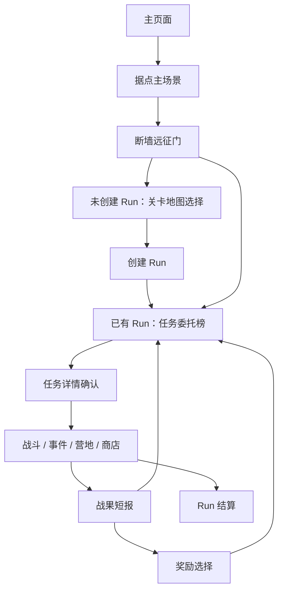

# 任务委托榜刷新系统完整设计

> 日期：2026-06-19  
> 状态：设计基线，待评审确认后进入实现  
> 范围：据点主场景中 `断墙远征门` 的任务委托榜、固定任务卡、自动补位、玩家主动刷新、Boss 解锁与设计审查。  
> 结论：采用 **固定 3 张委托卡 + 完成后免费补位 + 单卡主动刷新 + Boss 特殊通缉令** 的结构。它比路线节点图更适合当前主场景，也能提供更明确的肉鸽选择感。

## 1. 系统定位

任务委托榜是本局 Run 内的下一行动选择界面，不是关卡地图选择界面。

完整链路保持为：

`关卡地图选择` 回答“这一局去哪个区域”。  
`任务委托榜` 回答“这一局里下一步接哪个任务”。

两者都挂在 `断墙远征门` 下，但视觉和规则必须区分，避免玩家把局内任务卡误认为地图选择。

## 2. 设计目标

1. 让玩家每次回到据点都有明确的短期选择。
2. 避免节点图、路线连线和同层清空带来的开发态感。
3. 让委托榜持续有内容：完成一个任务后立即补新卡。
4. 支持玩家用资源刷新不想接的任务，但不能无限刷到最优解。
5. 让 Boss 出现像一次明确的阶段推进，而不是普通任务随机刷出来。
6. 保持当前 Run、战斗、事件、营地、商店逻辑可复用。
7. 为后续不同区域地图、任务池权重和难度节奏留下配置空间。

## 3. 核心玩法循环

任务委托榜的 30 秒循环：

1. 玩家回到据点，打开断墙远征门。
2. 看到 3 张当前可接委托卡。
3. 比较任务类型、风险、奖励和当前资源状态。
4. 接受一张任务，进入详情确认。
5. 完成任务并获得奖励。
6. 回到据点，该卡槽免费补入新委托。
7. 累计推进到阈值后，Boss 通缉令出现。

这个循环的重点不是“走哪条路线”，而是“这一轮愿意承担哪种风险换哪种收益”。

普通战斗不再显示独立大结算页。战斗后先出现一张轻量战果短报，只展示任务结论、守护值变化、目标损伤、奖励任务和下一步按钮；胜利从短报进入奖励选择页，奖励页顶部仍保留紧凑战果条；非终局失败从短报回到任务委托榜，顶部显示战果提示并补入新委托；Boss 可重试失败在短报中提供重试按钮；只有 Run 失败或通关进入 Run 结算。

## 4. 展示结构

### 4.1 面板结构

任务委托榜建议采用布告板式布局：

| 区域 | 内容 | 目的 |
|---|---|---|
| 标题区 | `任务委托`、当前区域名、委托进度 | 明确这是本局任务板 |
| Boss 区 | 未解锁提示 / Boss 通缉令 | 展示阶段目标 |
| 卡槽区 | 固定 3 张委托卡 | 当前可接任务 |
| 底部区 | 返回据点、刷新说明、资源提示 | 管理操作和退出 |

Boss 区不应与普通卡完全同级。Boss 是 Run 的阶段目标，应该像通缉令或告急令，而不是一张普通随机任务。

### 4.2 委托卡字段

每张卡保持短信息，不做长说明：

| 字段 | 示例 | 说明 |
|---|---|---|
| 任务名 | `铁角闸门` | 来自节点标题 |
| 任务类型 | `防守委托`、`补给委托`、`精英讨伐` | 先告诉玩家这是什么 |
| 风险 | `■■■□□ 3/5` | 快速比较难度 |
| 标签 | `裂隙压力`、`堵路拥挤` | 最多 2 个 |
| 奖励预览 | `余烬 +7 · 成长机会` | 区分收益 |
| 刷新按钮 | 右上角小按钮 | 单卡刷新 |
| 主操作 | `查看详情` | 不直接开战 |

卡片不显示节点层级、连线、路线位置或不可选任务。

### 4.3 卡片状态

| 状态 | 触发 | 表现 |
|---|---|---|
| 可接 | 默认状态 | 正常卡面，`查看详情` 可点 |
| 新补入 | 自动补位或刷新后 | 短暂高亮或盖章动效 |
| 刷新预览 | 鼠标悬停刷新按钮 | 显示消耗 |
| 资源不足 | 余烬不足且不允许强刷 | 刷新按钮置灰 |
| 可强刷 | 余烬不足但允许付腐化 | 刷新按钮显示危险态 |
| 锁定 | Boss、当前确认中或执行中 | 不允许刷新 |

## 5. 自动补位规则

自动补位是基础节奏，免费，不消耗资源。

1. 委托榜固定显示最多 3 张普通委托卡。
2. 玩家完成一张委托后，该卡从榜单移除。
3. 系统立即从候选池补入 1 张新委托。
4. 新委托不能与当前榜单上的任务重复。
5. 新委托不能是刚完成的任务。
6. 已完成任务不会重新进入本局候选池。
7. 自动补位不增加刷新费用。
8. 自动补位后，玩家主动刷新费用重置。

如果候选池暂时不足，优先保证至少 1 张战斗委托，其次补事件 / 营地 / 商店。正常配置下不应出现空榜。

## 6. 玩家主动刷新

主动刷新是策略选择，必须有代价。

### 6.1 推荐规则

第一版推荐 **单卡刷新** ，不做整榜刷新：

1. 每张普通委托卡右上角有刷新按钮。
2. 刷新只替换这一张卡。
3. Boss 卡不能刷新。
4. 当前已进入执行中的任务不能刷新。
5. 进入详情页但未开始任务，返回委托榜后仍可刷新。
6. 每次主动刷新消耗余烬。
7. 每完成一个委托后，刷新费用重置。

### 6.2 费用曲线

刷新费用按本轮委托榜的主动刷新次数递增：

| 本轮主动刷新次数 | 费用 |
|---|---|
| 第 1 次 | 1 余烬 |
| 第 2 次 | 2 余烬 |
| 第 3 次及以后 | 3 余烬 |

这里的“本轮”指两次完成委托之间的选择窗口。玩家完成任意委托后，费用回到 1。

选择全局递增而不是单卡独立递增，是为了防止玩家把 3 张卡都用低成本洗一遍。

### 6.3 强行刷新

余烬不足时，可以支持强行刷新，但要明显告知代价。

推荐规则：

1. 余烬不足时，刷新按钮进入危险态。
2. 玩家确认后可以强行刷新。
3. 强行刷新消耗 `腐化 +1`。
4. 每完成一个委托前，最多强行刷新 1 次。
5. Boss 解锁后不允许强行刷新 Boss。

强行刷新是救场手段，不是常规洗牌手段。它让玩家在资源不足时仍有选择，但会把压力带到后续战斗。

### 6.4 不建议做整榜刷新

整榜刷新容易产生三个问题：

1. 玩家会把它当成“刷商店”，不断洗到最佳组合。
2. 3 张卡同时变化，玩家难以记住自己为什么刷新。
3. 如果 Boss、精英、商店混在一起，刷新结果的波动过大。

后续如果需要整榜刷新，建议作为稀有道具或一次性据点能力，而不是常规按钮。

## 7. 候选池生成规则

候选池不直接展示路线图，但底层仍可以使用当前 `route_nodes` 和 `layer` 数据作为进度控制。

### 7.1 基础过滤

候选任务必须满足：

1. 未完成。
2. 未在当前榜单中。
3. 未被本次刷新操作刚刚移除。
4. 普通委托候选池始终排除 Boss；Boss 由独立通缉令区域管理。
5. 符合当前进度窗口。
6. 符合区域地图的任务池配置。

### 7.2 进度窗口

进度窗口用于避免开局刷出过深任务。

| 阶段 | 条件 | 允许任务 |
|---|---|---|
| 开局 | 完成 0 到 1 张 | 普通战、低风险事件、低价商店 |
| 前期 | 完成 2 到 3 张 | 普通战、事件、营地、少量精英候选 |
| 中期 | 完成 4 到 5 张 | 精英、较高风险普通战、补给、营地 |
| Boss 前 | Boss 已解锁但未挑战 | 少量补强委托；Boss 通缉令由独立区域展示 |

底层可以继续复用 `layer`，但前台不说“第几层”。

### 7.3 类型保底

为了保证选择质量，委托榜需要类型保底：

1. 榜单中至少 1 张战斗类委托。
2. 榜单中最多 1 张商店或营地类整备委托。
3. 开局前 2 张完成前，不出现高风险精英。
4. 同一榜单不出现 2 张同 ID 或同标题任务。
5. 最近 2 次被刷新掉的任务尽量不立刻回来。

如果候选池无法满足所有条件，优先级为：

`不重复 ID > 至少 1 战斗 > Boss 规则 > 整备上限 > 最近刷新回避`

### 7.4 区域差异

不同关卡地图改变权重，而不是改变委托榜规则。

| 区域 | 倾向 | 权重表现 |
|---|---|---|
| 断墙外环 | 均衡 | 战斗、事件、整备比例接近 |
| 裂隙回廊 | 高压 / 成长 | 战斗和精英权重更高，奖励成长更好 |
| 废弃军需线 | 资源 / 补给 | 商店、事件、营地权重更高，余烬规划更重要 |

这样玩家在关卡地图选择阶段做长期风格选择，在委托榜阶段做短期风险选择。

## 8. Boss 解锁与出现

### 8.1 解锁条件

第一版建议沿用清晰阈值：

`完成 5 张非 Boss 委托后，Boss 解锁。`

这个值可以配置到区域地图中。高压地图可以是 4，资源地图可以是 6，但第一版统一 5 更容易验证。

### 8.2 Boss 展示方式

推荐 Boss 不占普通 3 卡槽，而是进入上方特殊通缉令区域：

1. 未解锁时显示进度：`Boss 线索 3 / 5`。
2. 解锁后显示 `Boss 讨伐令`。
3. Boss 讨伐令不可刷新。
4. 玩家可以直接挑战 Boss。
5. 玩家也可以继续接普通委托补强，但会承担额外压力。

如果实现成本要压低，第一版也可以让 Boss 替换为唯一可选卡。但从长期体验看，特殊通缉令更好，因为玩家有“现在打 Boss 还是再贪一次”的肉鸽决策。

### 8.3 Boss 后继续接委托的代价

Boss 解锁后继续做普通委托，需要防止无限补强。

推荐规则：

| Boss 解锁后额外完成普通委托数 | 代价 |
|---|---|
| 第 1 张 | 腐化 +1 |
| 第 2 张 | 腐化 +1，下一战风险 +1 |
| 第 3 张及以后 | 不建议允许，或直接强制进入 Boss |

这个规则让玩家可以补一次关键资源，但不鼓励拖延。

## 9. 刷新结果质量

刷新系统的体验好坏主要取决于结果质量，而不是按钮本身。

### 9.1 好的刷新结果

一次刷新应该让玩家觉得：

1. 换掉了不想接的任务。
2. 新任务和旧任务有明显差异。
3. 代价是可理解的。
4. 没有刷出明显无意义的重复。

### 9.2 坏的刷新结果

需要避免：

1. 刚刷掉 `商店`，又刷出另一个几乎一样的商店。
2. 余烬不足时连续刷出付费商店。
3. 三张卡全是非战斗，主循环停摆。
4. 三张卡全是高风险战斗，玩家没有调整空间。
5. Boss 解锁后被普通刷新覆盖或消失。

### 9.3 推荐权重因子

候选池排序或加权时可考虑：

| 因子 | 作用 |
|---|---|
| 当前完成数 | 控制任务深度 |
| 当前余烬 | 余烬低时略提高战斗和事件权重 |
| 守护值 | 守护值低时略提高营地 / 修复机会，但不保证 |
| 存活守卫者 | 残编时降低精英连续出现概率 |
| 最近任务类型 | 避免连续过多同类型 |
| 区域地图 | 体现地图风格 |
| 刷新来源 | 主动刷新时更强地避开刚刷掉的类型 |

注意：这些权重只影响概率，不应该把系统变成自动救济。肉鸽选择需要不完美局面。

## 10. 数据结构建议

当前 `RunState` 已有 `active_commission_ids`，后续可以扩展为更明确的委托状态。

### 10.1 Run 级字段

建议字段：

| 字段 | 类型 | 用途 |
|---|---|---|
| `active_commission_ids` | `Array[String]` | 当前普通委托槽 |
| `completed_commission_count` | `int` | 已完成非 Boss 委托数，可由 `visited_nodes` 推导 |
| `manual_refresh_count` | `int` | 本轮主动刷新次数 |
| `forced_refresh_used` | `bool` | 本轮是否已强刷 |
| `recent_rejected_commission_ids` | `Array[String]` | 最近被主动刷掉的任务 |
| `boss_commission_unlocked` | `bool` | Boss 是否解锁，可由完成数推导 |
| `post_boss_extra_commissions` | `int` | Boss 解锁后继续完成的普通委托数 |

如果想保持存档小，可以让部分字段由历史推导，但主动刷新次数和最近拒绝列表建议存下来。

### 10.2 方法建议

| 方法 | 作用 |
|---|---|
| `available_route_nodes()` | 返回当前可展示委托，保留兼容 |
| `complete_current_commission()` | 完成当前委托并触发自动补位 |
| `can_refresh_commission(slot_index)` | 判断卡槽是否可刷新 |
| `refresh_commission(slot_index, mode)` | 主动刷新单卡 |
| `refresh_commission_cost()` | 返回当前余烬费用 |
| `commission_refill_candidates(reason)` | 生成候选池 |
| `boss_commission_status()` | 返回未解锁 / 已解锁 / 已完成 |

### 10.3 配置建议

区域地图可配置：

| 配置 | 默认值 | 说明 |
|---|---|---|
| `board_size` | 3 | 普通委托槽数量 |
| `boss_unlock_count` | 5 | Boss 解锁所需非 Boss 委托数 |
| `manual_refresh_costs` | `[1, 2, 3]` | 主动刷新费用 |
| `max_support_cards` | 1 | 商店 / 营地上限 |
| `min_battle_cards` | 1 | 战斗类保底 |
| `elite_unlock_count` | 2 | 精英进入候选池的完成数 |
| `post_boss_extra_limit` | 2 | Boss 解锁后可额外补强次数 |

## 11. UI 交互细节

### 11.1 打开委托榜

已有 Run 时，点击 `断墙远征门`：

1. 打开 `任务委托` 面板。
2. 顶部显示当前区域名。
3. 显示 Boss 进度或 Boss 通缉令。
4. 显示 3 张普通委托卡。

### 11.2 刷新单卡

玩家点击某张卡右上角刷新：

1. 如果余烬足够，直接消耗并替换。
2. 如果余烬不足但可强刷，弹出确认。
3. 如果不可刷新，按钮置灰并显示原因。
4. 刷新后新卡播放短暂补入动效。

刷新按钮不要和 `查看详情` 抢视觉主次。建议使用小图标加费用标记。

### 11.3 任务详情返回

进入任务详情但未开始任务时：

1. `返回任务布告` 回到当前榜单。
2. 当前任务仍在原卡槽。
3. 玩家可以改选其他卡。
4. 玩家可以刷新该卡，前提是任务尚未开始。

### 11.4 Boss 通缉令

Boss 解锁前：

- 显示 `Boss 线索 3 / 5`。
- 不占普通卡槽。
- 可以有低亮度剪影或封条。

Boss 解锁后：

- 显示高危险通缉令。
- 主要按钮是 `挑战 Boss`。
- 辅助提示说明继续做普通委托会增加压力。

## 12. 数值与节奏建议

第一版建议：

| 项 | 数值 |
|---|---|
| 普通委托槽 | 3 |
| Boss 解锁所需非 Boss 委托 | 5 |
| 精英开始出现 | 完成 2 张后 |
| 主动刷新费用 | 1 / 2 / 3 余烬 |
| 费用重置 | 完成任意委托后 |
| 强行刷新 | 腐化 +1，每轮最多 1 次 |
| Boss 解锁后额外普通委托 | 最多 2 张 |
| Boss 解锁后额外代价 | 腐化 +1，第二张再加下一战风险 |

如果测试发现玩家太容易刷到想要的任务，优先提高刷新费用或限制强刷，不要直接减少卡槽。3 张卡是选择感的基础。

## 13. 与现有实现的关系

当前实现已经具备：

1. `COMMISSION_BOARD_SIZE = 3`。
2. `COMMISSION_BOSS_UNLOCK_COUNT = 5`。
3. `active_commission_ids`。
4. 完成委托后自动从榜单移除并补入新委托。
5. 任务卡式展示。
6. 关卡地图选择和任务委托榜已通过断墙远征门区分。

缺失的完整系统能力：

1. 单卡主动刷新。
2. 刷新费用和强刷代价。
3. 最近刷掉任务的回避列表。
4. Boss 特殊通缉令区域。
5. Boss 解锁后继续补强的压力代价。
6. 更明确的区域地图权重配置。
7. 刷新按钮和刷新状态 UI。

## 14. 不做内容

第一版不做：

- 不做节点路线图。
- 不做整榜无限刷新。
- 不做实时倒计时刷新。
- 不做每日任务或在线任务系统。
- 不做复杂任务合成。
- 不做完整城镇经营入口。
- 不把关卡地图选择混入委托榜。

## 15. 验收标准

1. 未创建 Run 时，断墙远征门打开关卡地图选择。
2. 已有 Run 时，断墙远征门打开任务委托榜。
3. 委托榜固定显示 3 张普通委托卡。
4. 完成任意普通委托后，原卡移除并免费补入新卡。
5. 主动刷新只替换单张普通委托卡。
6. 主动刷新消耗余烬，费用按 1 / 2 / 3 递增。
7. 完成任意委托后，主动刷新费用重置。
8. 余烬不足时可强行刷新，代价为腐化 +1，且每轮最多 1 次。
9. Boss 不可刷新。
10. 完成 5 张非 Boss 委托后，Boss 通缉令出现。
11. Boss 解锁后继续做普通委托会增加压力。
12. 委托榜里至少 1 张战斗类委托。
13. 委托榜里最多 1 张商店 / 营地类整备委托。
14. 刚刷新掉的任务不会立刻回到同一槽位。
15. 任务详情返回后，榜单状态不丢失。

## 16. 设计审查

### 16.1 适合点

这个方案适合当前项目，原因是：

1. 它保留了据点主场景的地点感，不把玩家拉回开发态路线图。
2. 固定 3 张卡能提供稳定选择，不会信息过载。
3. 完成后补位能让 Run 持续滚动，节奏比“清完一组再刷新”更顺。
4. 单卡刷新提供玩家控制感，但资源消耗能限制滥用。
5. Boss 通缉令能形成阶段目标，比随机出现的 Boss 卡更有仪式感。
6. 当前代码已有 3 卡、自动补位、Boss 阈值的雏形，后续实现不是推倒重来。

### 16.2 风险

| 风险 | 表现 | 处理 |
|---|---|---|
| 玩家无限刷最优解 | 难度被洗掉 | 全局递增费用、强刷限制 |
| 委托重复感强 | 刷新后像没变 | 最近拒绝列表、类型差异权重 |
| 非战斗太多 | 主循环停滞 | 至少 1 张战斗保底 |
| 整备太少 | 玩家残血无解 | 权重略受守护值和存活人数影响 |
| Boss 后无限补强 | Boss 压力被拖没 | 额外普通委托增加腐化 / 风险 |
| 地图选择和委托榜混淆 | 玩家分不清两个层级 | 入口文案、标题、视觉材质区分 |
| 候选池规则过严 | 无法补满 3 张 | 设置优先级和兜底策略 |

### 16.3 需要坚持的边界

1. 委托榜不是地图路线图。
2. Boss 不是普通随机任务。
3. 刷新不是免费洗牌。
4. 卡片数量不要轻易超过 3。
5. 刷新只换单卡，不默认换整榜。
6. 自动补位免费，主动刷新付费。

### 16.4 审查结论

该系统方向是合适的。它能加强肉鸽感，也能解决当前“任务完成后列表变少”和“路线节点图不适合主场景”的问题。

建议进入实现时按两步做：

1. 第一阶段：补齐单卡刷新、费用、强刷、最近拒绝列表和测试。
2. 第二阶段：把 Boss 从普通卡槽提升为特殊通缉令，并加入 Boss 解锁后的额外压力。

第一阶段能先验证刷新是否好玩；第二阶段再强化 Boss 的阶段感和长期节奏。
