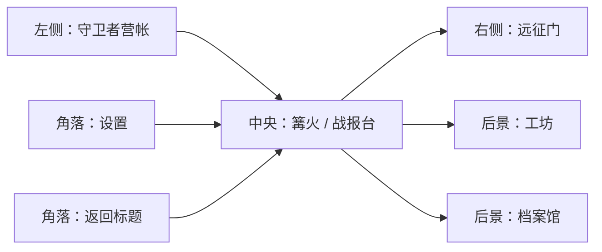
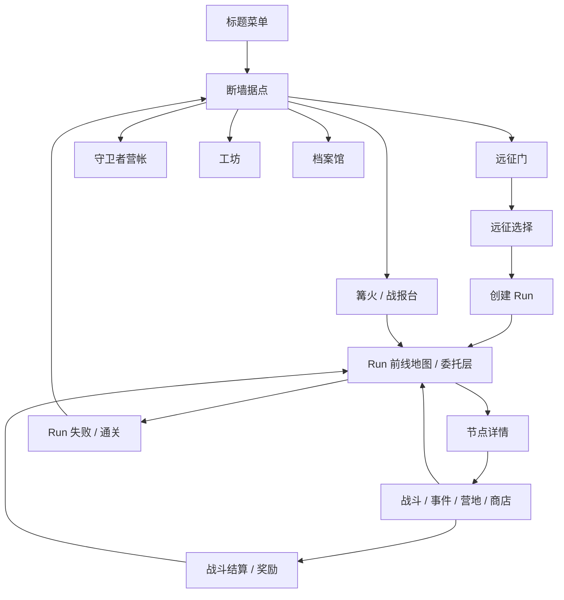

# 正式版主场景节点结构设计

> 日期：2026-06-21  
> 状态：第一版主场景节点规格  
> 范围：正式版主场景 `断墙据点` 的可交互节点、资源边界、短期占位和后续扩展。  
> 结论：主场景采用 **5 个核心节点 + 2 个系统入口** 。核心节点为 `远征门`、`守卫者营帐`、`工坊`、`档案馆`、`篝火 / 战报台`；系统入口为 `设置` 和 `返回标题`。

## 1. 背景

当前项目已经跑通主菜单、据点入口、地图选择、任务委托、战斗和奖励闭环。但从正式游戏看，当前据点更接近流程承接页，不应继续把全局据点、Run 内路线选择和战斗结算都压在同一层。

正式版需要先确定主场景节点，作为后续拆分资源、存档、页面和美术布局的基础。

## 2. 设计目标

1. 主场景代表玩家的长期据点，不直接等同于当前 Run。
2. 开始新 Run、继续未完成 Run、查看长期成长、查阅资料和进入系统设置都有稳定入口。
3. 全局资源、Run 资源、节点资源和战斗内资源边界清楚。
4. 第一版可以占位，但节点命名和职责必须能承接正式版扩展。
5. 不把主场景做成一排菜单按钮，而是做成有空间关系的据点热点。

## 3. 主场景节点总表

| 节点 | 类型 | 第一版行为 | 正式职责 |
|---|---|---|---|
| 远征门 | 核心节点 | 进入远征选择 | 选择地区、章节主题、敌人池、地图池、Boss 倾向和风险词条 |
| 守卫者营帐 | 核心节点 | 查看当前守卫者和占位说明 | 管理守卫者名册、职业定位、解锁状态、出征队伍 |
| 工坊 | 核心节点 | 查看遗物 / 升级占位 | 管理全局图纸、永久解锁、已见遗物和构筑知识 |
| 档案馆 | 核心节点 | 查看图鉴占位 | 查阅敌人、地图机制、Boss、事件、教程和战报记录 |
| 篝火 / 战报台 | 核心节点 | 继续未完成 Run 或查看最近战报 | 承接当前 Run 状态、失败记录、最近结算和继续游戏 |
| 设置 | 系统入口 | 打开设置占位 | 音量、显示、输入、辅助功能 |
| 返回标题 | 系统入口 | 回到标题菜单 | 离开据点，不改变 Run 状态 |

## 4. 推荐空间布局

主场景使用横向据点构图，保证玩家先读到地点，再读到功能。

视觉优先级建议：

1. `远征门`：最亮、最明确的出发入口。
2. `篝火 / 战报台`：中央状态焦点，承担继续 Run。
3. `守卫者营帐`：角色与队伍存在感。
4. `工坊` 和 `档案馆`：后景建筑，第一版可以低调占位。
5. `设置` 和 `返回标题`：小型系统按钮，不占据世界焦点。

## 5. 节点细则

### 5.1 远征门

远征门负责开始一局新的 Run。它打开的是 `远征选择`，不是直接打开 Run 内任务列表。

第一版显示：

- 可选地区，例如 `断墙外环`、`裂隙回廊`、`废弃军需线`。
- 地区定位，例如 `标准 / 均衡`、`高压 / 成长`、`资源 / 补给`。
- 预告字段：主要敌人、地图主题、Boss 倾向、推荐难度。

资源边界：

- 可读全局资源：已解锁地区、难度、已见敌人、已解锁守卫者。
- 可创建 Run 资源：`run_id`、`run_seed`、`expedition_id`、章节配置、路线图。
- 不直接修改战斗内资源。

### 5.2 守卫者营帐

守卫者营帐负责角色层。它展示玩家拥有谁、谁可出征、谁已经阵亡或未解锁。

第一版显示：

- 当前 3 名守卫者。
- 名称、职责、基础 HP、移动、攻击范围。
- 出征队伍占位，不提供复杂编队。

正式版扩展：

- 守卫者解锁。
- 出征队伍选择。
- 职业说明与技能预览。
- 阵亡记录或纪念。

资源边界：

- 可读全局资源：守卫者基础定义、解锁状态、图鉴说明。
- 可读 Run 资源：当前 Run 内守卫者 HP 和死亡状态。
- 不应直接治疗当前 Run 守卫者，避免破坏 Run 损耗。

### 5.3 工坊

工坊负责长期构筑知识和永久解锁，不等同于 Run 内商店或 Run 内工坊节点。

第一版显示：

- 已见遗物列表占位。
- 守卫者升级和图纸占位。
- 说明当前版本还未开放永久改装。

正式版扩展：

- 遗物图纸解锁。
- 守卫者升级树。
- 可查看但不直接发放当前 Run 遗物。
- 全局经济或永久货币，如后续需要，可以从这里接入。

资源边界：

- 可读写全局资源：图纸、永久解锁、已见遗物。
- 可读 Run 资源：当前 Run 已持有遗物，只用于展示。
- 不直接写入当前 Run 的临时奖励。

### 5.4 档案馆

档案馆负责认知层，帮助玩家理解规则、敌人和世界。

第一版显示：

- 敌人图鉴占位。
- 地形机制占位。
- Boss 和事件记录占位。

正式版扩展：

- 敌人行为说明。
- 地图机制教程。
- Boss 档案。
- 事件记录。
- 历史战报和失败复盘。

资源边界：

- 可读写全局资源：已见敌人、已见地图机制、教程完成状态。
- 可读 Run 资源：最近战斗摘要。
- 不改变 Run 进度。

### 5.5 篝火 / 战报台

篝火 / 战报台是当前状态节点。它不负责开始新 Run，开始新 Run 始终从远征门进入。

第一版显示：

- 有未完成 Run：显示 `继续远征`、地区、节点进度、守护值、存活守卫者。
- 无未完成 Run：显示最近战报、失败记录或据点状态。

正式版扩展：

- 继续 Run。
- 查看最近一次战斗结算。
- 查看失败 / 通关摘要。
- 从崩溃恢复点回到节点前。

资源边界：

- 可读写 Run 资源：继续当前 Run、恢复当前 phase。
- 可读全局资源：最近战报历史。
- 不创建新 Run。

## 6. 不进入主场景核心节点的内容

### 6.1 主场景商店

不建议第一版加入主场景商店。主场景商店容易和 Run 内商店混淆。如果后续需要全局商店，必须先定义全局货币和永久购买内容。

### 6.2 主场景治疗营地

不建议在主场景提供治疗。守卫者 HP 和守护值是 Run 内损耗资源，应通过 Run 内营地、事件、奖励和商店恢复。

### 6.3 任务布告板

任务布告板不作为全局主场景核心节点。正式版应由 `远征门` 进入地区选择，再进入当前 Run 的前线地图或委托层。布告板可以是 Run 内表现形式，而不是全局据点入口。

## 7. 资源划分

| 层级 | 所属内容 | 主场景节点关系 |
|---|---|---|
| 全局资源 | 设置、图鉴、守卫者解锁、永久图纸、已见内容 | 营帐、工坊、档案馆、设置读写 |
| 远征配置 | 地区、章节主题、敌人池、地图池、Boss 池、词条 | 远征门读取并创建 Run |
| Run 资源 | 当前路线、守护值、余烬、腐化、守卫者当前 HP、遗物、当前 phase | 篝火 / 战报台读取并恢复 |
| Run 节点资源 | 事件、商店、营地、战斗节点、奖励节点 | 不在主场景直接处理 |
| 战斗内资源 | 8x8 grid、单位、出怪、危险预告、动画状态 | 主场景不直接持有 |

## 8. 页面流

## 9. 实现拆分建议

这份节点规格只决定主场景结构，不要求立即完成所有功能。后续实现建议按以下顺序：

1. 拆出 `MainHubScene`，只负责据点热点和主场景布局。
2. 拆出 `ExpeditionSelectScene`，由远征门进入，负责创建 Run。
3. 拆出 `RunMapScene` 或 `CommissionScene`，负责当前 Run 内节点选择。
4. 拆出 `HubStatusPanel`，供篝火 / 战报台展示当前 Run 摘要。
5. 营帐、工坊、档案馆先做只读占位，不写 Run 状态。

## 10. 验收标准

1. 主场景中有 5 个核心节点和 2 个系统入口。
2. `开始新 Run` 只从远征门进入。
3. `继续 Run` 只从篝火 / 战报台进入。
4. 守卫者营帐、工坊和档案馆不直接改变当前 Run 损耗资源。
5. 主场景不直接显示 Run 内任务列表。
6. Run 内任务列表或委托榜必须从远征选择创建 Run 后进入，或从篝火继续 Run 后恢复。
7. 主场景节点的可见性和占位行为不依赖具体 Demo 路线。

## 11. 开放问题

1. 正式版是否需要全局货币。如果需要，主场景工坊或后续商店才有写全局经济的职责。
2. 守卫者是否允许 Run 外永久强化。如果允许，需要先定义强化是否影响平衡和新手引导。
3. 前线地图最终使用路线图、委托榜，还是二者混合。当前建议使用混合方案：地图展示路径压力，卡片承接当下决策。
